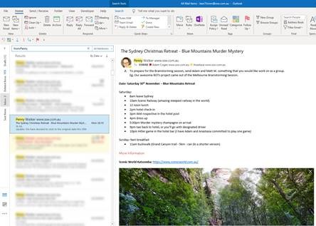
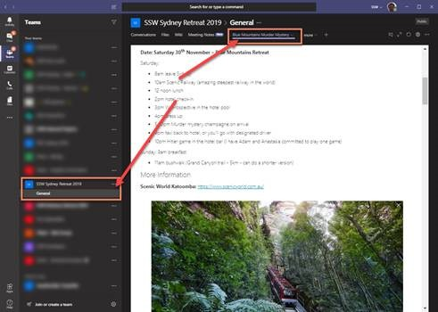
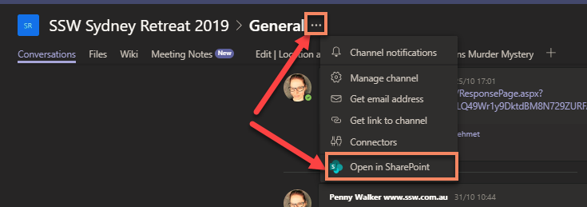
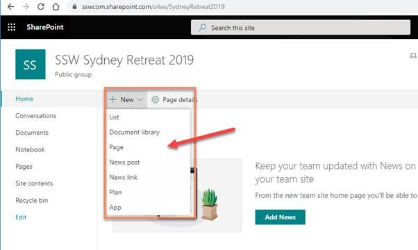
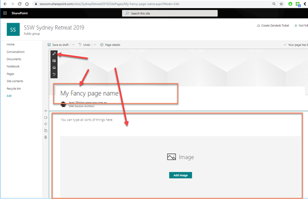
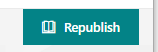
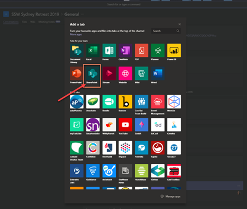

​Some information sent via email, such as an event agenda will often be accessed multiple times by recipients. Instead of having to search through your mailbox every time you need the details of an invitation, if you are using Microsoft Teams you can easily set up a page as a tab inside your Team.​  

 <excerpt class='endintro'></excerpt> 

​A SharePoint page can also have dynamic content such as Document Library views, Youtube players, and much more. You can even embed your own custom web parts, rendered in Teams with full fidelity.​​ 
<dl class="badImage"><dt>
</dt><dd>Bad Example: Details sent via Email</dd></dl><dl class="goodImage"><dt></dt><dd>Good Example: Details set as a SharePoint page, visible in a Team’s tab</dd></dl>
To set up a SharePoint Page as a Tab in Teams, follow these steps:

1. Navigate to SharePoint:
<dl class="image"><dt></dt><dd>Figure: Navigating to SharePoint from Teams</dd></dl>
2. Create a SharePoint page
<dl class="image"><dt>
</dt><dd>Figure: adding a new SharePoint page</dd></dl>
3. Customize it
<dl class="image"><dt></dt><dd>Figure: Customizing the page using the different controls</dd></dl>
4. Publish it (tips: you can even share it via Email or Promote it as a News)
<dl class="image"><dt></dt><dd>Figure: Publishing the page​ </dd></dl><dl class="image"><dt></dt><dd>Figure: several options available once the page is published</dd></dl>
5. Go To Teams and Add new Tab

6. Select “SharePoint”
<dl class="image"><dt></dt><dd>Figure: Adding the page as a tab in Teams</dd></dl>
7. Select the page you just published and hit “save”
<dl class="image"><dt></dt><dd>Figure: picking the page from the menu </dd></dl>

