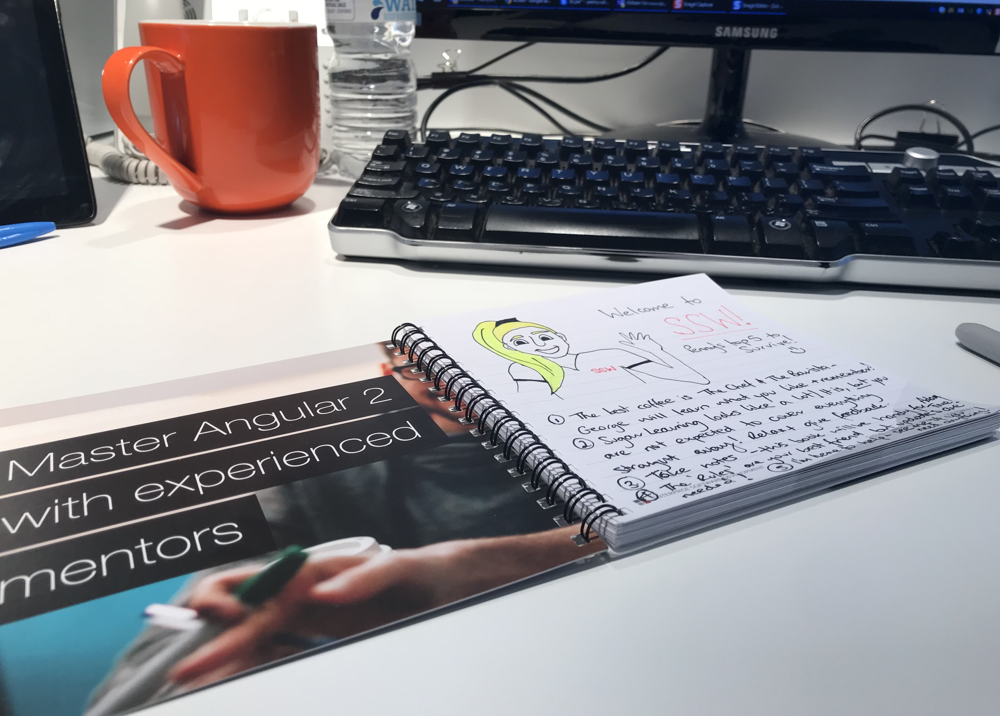
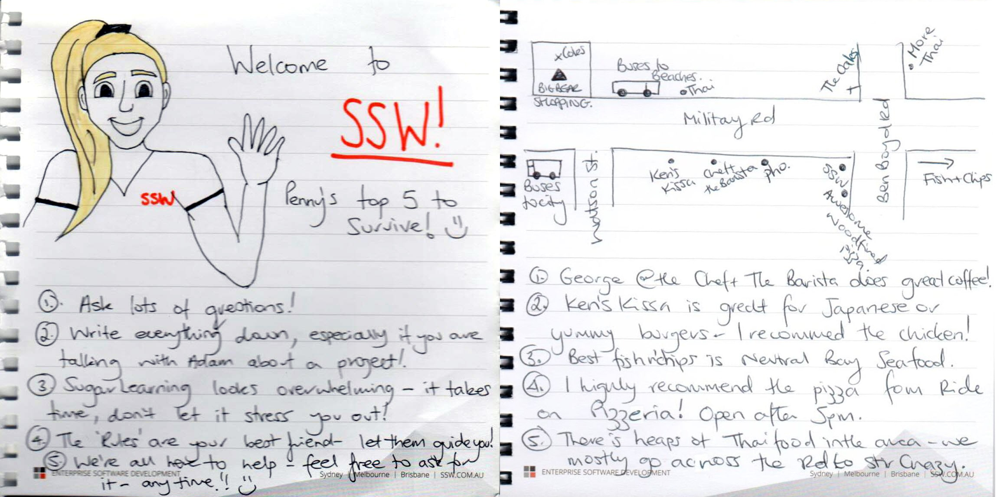

The first day of a new job can be daunting.  For the new starter, the workplace is unfamiliar, their colleagues are strangers, and there’s so much to learn they think their head might explode. All up, it’s a stressful time.

There are few simple ways to help new hires feel more comfortable as they adjust to their new workspace:

<!--endintro-->

### Before they start

Prior to the newcomer’s arrival, make sure their desk and work area are clean by giving the desktop, monitor, mouse and keyboard a wipe with a damp cloth. Then test that the equipment on their desk, such as the computer, phone and any other electronics, is in good working condition.

::: good 
  
:::

### The day before they start

Give them a call and make sure they're ready and know what to bring with them, what to wear, etc.

At SSW we give the newcomers the option to bring their own equipment, so make sure to ask them before they start.

### On their first day

On the newcomer’s first day, have the manager leave a short “welcome to the company” handwritten note and a cup of good coffee at the newcomer’s workstation to greet them first thing (The welcome message could even be written ON the cup if possible). Make sure they have someone looking after them.

Other nice days could include:

* A mug
* A map of the area with some cool things pointed out (good coffee spots, restaurants, etc.)
* Use a blank notebook to write a welcome note and put handy hints inside, then they can continue to use the notepad during induction!

::: good  
  
:::

It’s also a nice idea to take the newbie out to lunch on their first day so they can get to know their co-workers outside of the office. NB: check if they have any special dietary requirements.

These are some thoughtful ways to show the new hire that the company is pleased to have them on board, and leaves them with a good first impression of their new workplace.

`oembed: https://twitter.com/SSW_TV/status/1176056364197658624`

::: info
Find the longer version of this post on [Facebook](https://www.facebook.com/SSW.page/photos/pb.120920301257947.-2207520000.1569264924./3020784747938140/?type=1&theater) and [LinkedIn](https://www.linkedin.com/posts/ssw_the-1st-day-of-a-new-job-can-be-daunting-activity-6581822083670642688-DFTl).
:::
