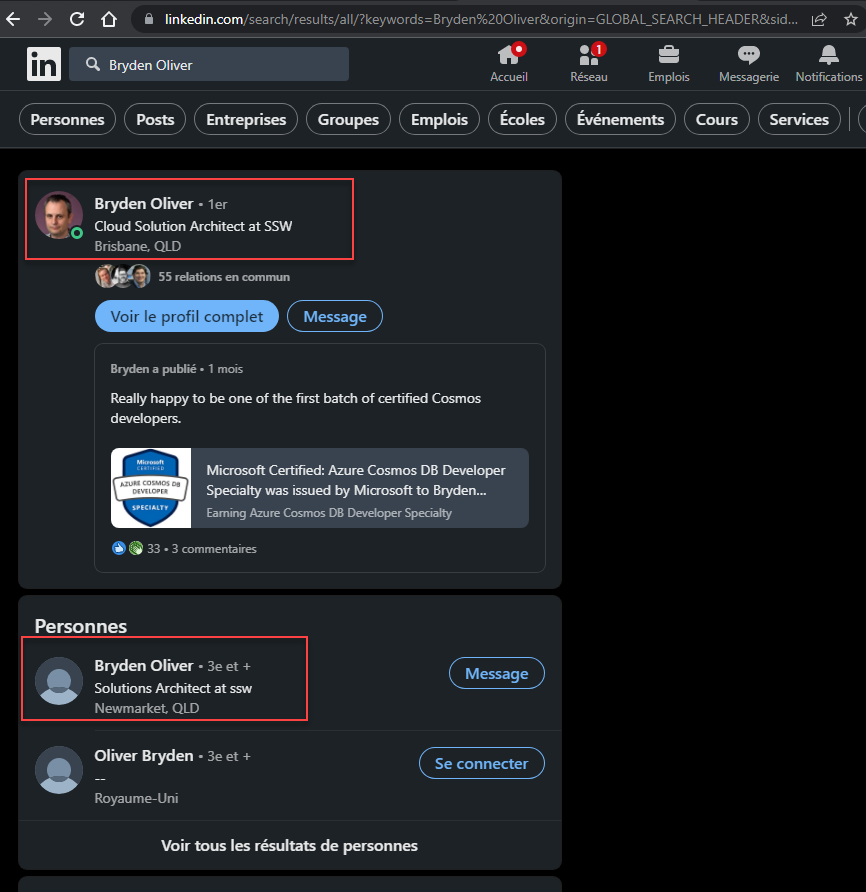
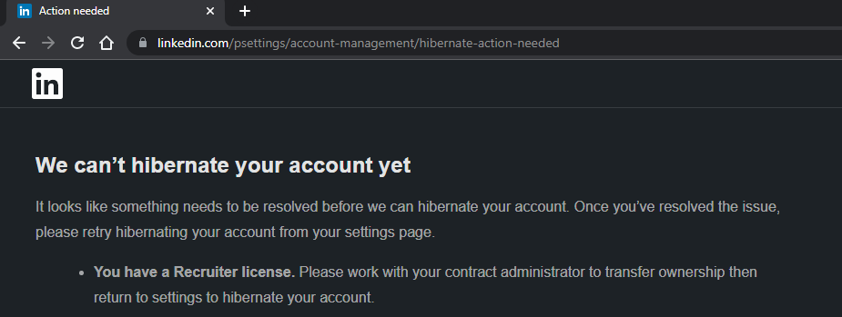
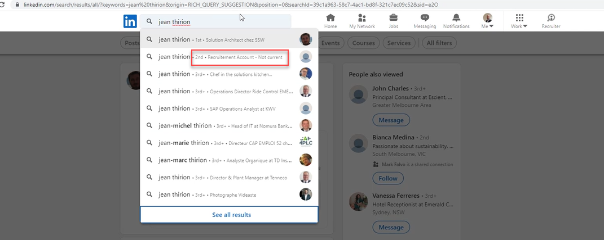

If you’re working with LinkedIn Talent Hub solutions and don’t want to use your primary LinkedIn account, you will need to create a second one. The issue is that the secondary account will show up when people search for your name:

<!--endintro-->

::: bad

:::

Unfortunately there is no way to disable/hide your secondary profile if it is associated with Talent Hub: 

The only workaround is to make your secondary account more obvious by adding a clear description:

::: good

:::