When dealing with western people, you want to avoid having screen captures etc. showing foreign characters.

Let us look at some examples:

<!--endintro-->

### Google Chrome

::: bad  
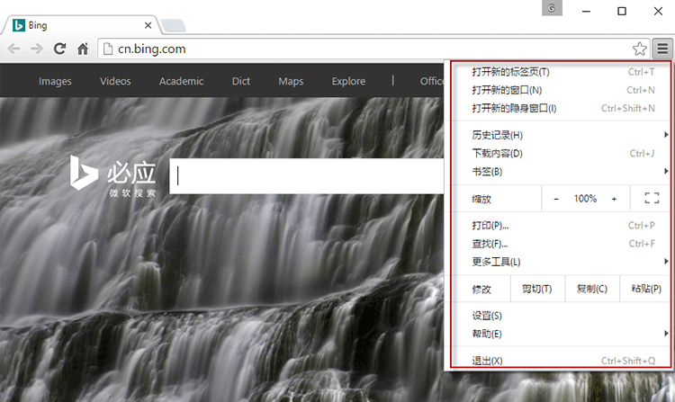  
:::

::: good  
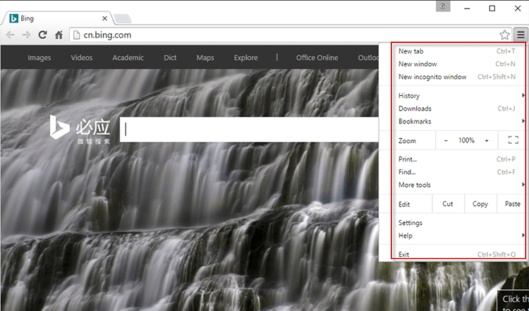  
:::

### How to fix on a PC?

You want all screenshots you take to be showing English. Most of the time it is as simple as going Tools | Options | Language | Default Language = English (US).

In Chrome, you can follow these steps directly:

1. Three dots bar at the top right of the Chrome window: 
          

  

2. Click on Settings: 
      
  

3. Click on Advanced: 
      
  

4. Click on 'Add Languages': 
      
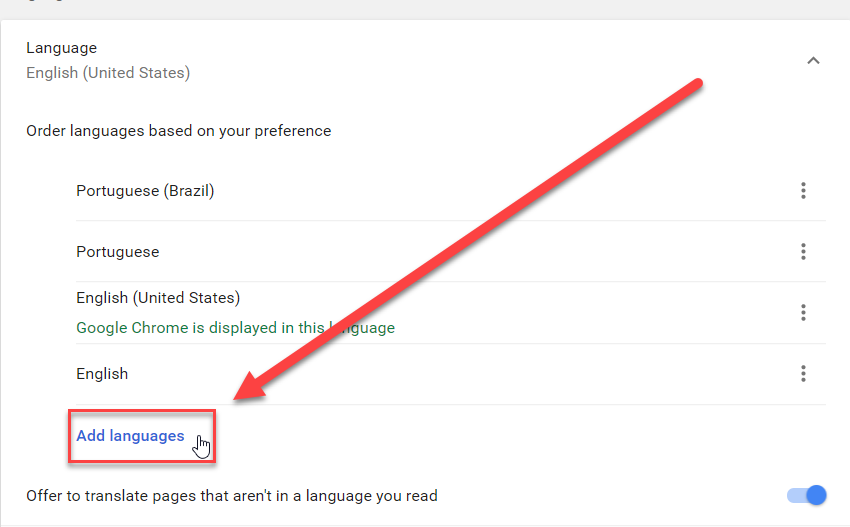  

5. Move English to the top 
      
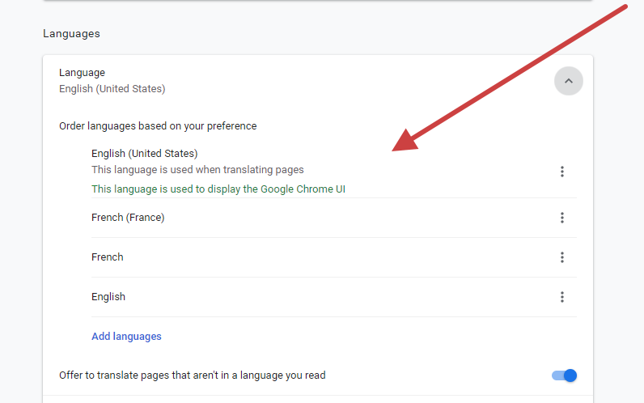  

### How to fix on a Mac?

1. Change the language in System Preferences. Go to Apple menu | System Preferences | Language & Region. 
      
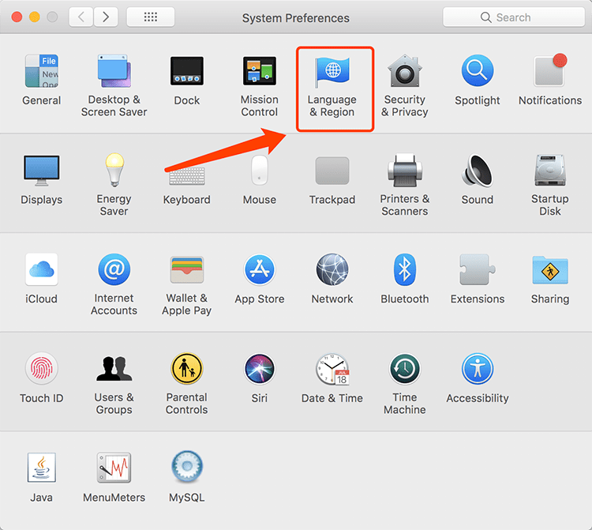  

2. In Preferred languages, add English and select it as primary language: 
      <dd> Figure: In Language & Region, add English</dd>
3. Reboot the system and verify that English is now the primary language for all desktop applications.

### How to fix your Google account?

You should also change your Google language to English as well. If it is not already, take a look at these steps:

1. Go to www.google.com
2. Click on `Sign-In` or `My Account` if you are already signed in 
      
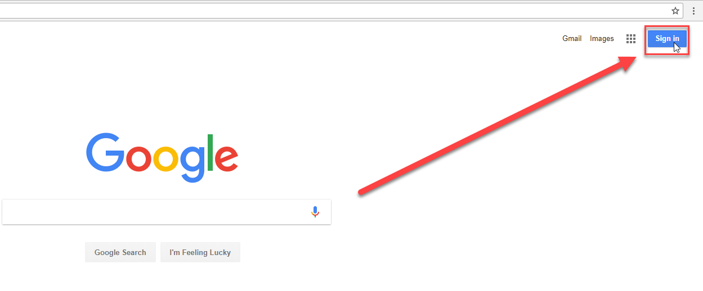  

  

3. Search for 'Language': 
      
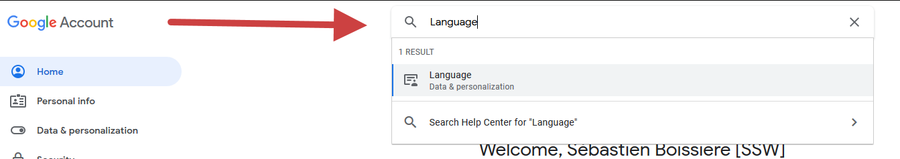  

4. Now click `Language` and search for English 
      
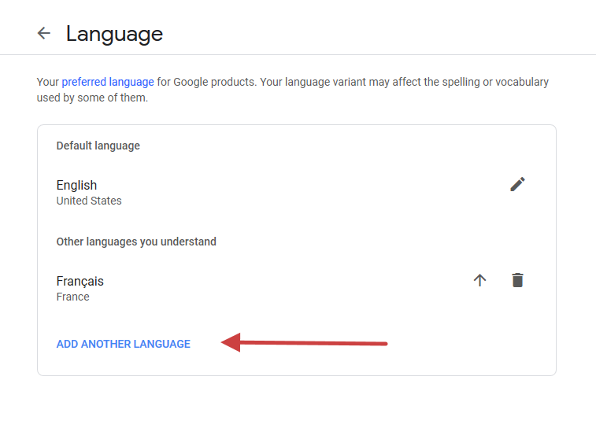  

5. Move English up to Default language by clicking on the arrow

  

6. Done! You changed your language to English.

### How to fix your Gmail account?

1. Click on the cog then Settings 
      
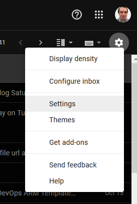  

2. Set language to English(US) 
      
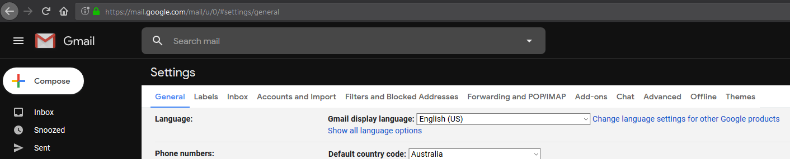  

3. Scroll down and click on 'Save Changes'. Done!

### How to fix Mozilla Firefox?

1. Go to Options 
      
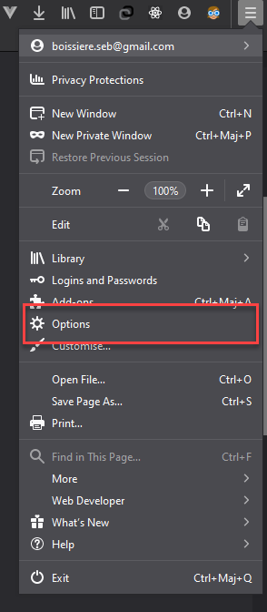  

2. Set Display language to English(United States), you may have to restart Firefox to apply the change 
      
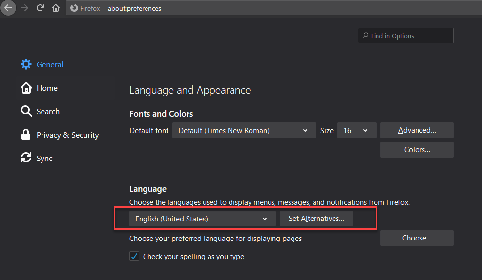  

3. Choose your preferred language for displaying pages. Add English(UnitedStates) and move it to the top. 
      
  

  

4. Done!

### How to fix on MS Azure?

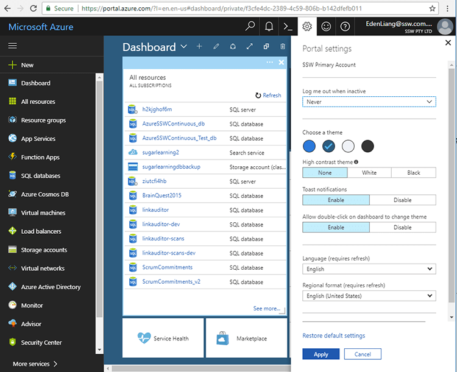  

### How to fix on MS Office 365 (rich client)

::: bad  
  
:::

::: good
Figure: If you do not have the English version. In Microsoft Office open the rich client application such as Outlook or Word, then install and configure as per the image above  
:::

### How to fix on Office 365 (https://outlook.office365.com)

1. Go to https://outlook.office.com  

  

2. Click on "My profile" in the top right corner  

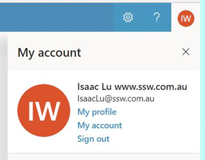  

3. Click on "setting" button  

  

4. Click on Region and time zone  

  

5. In Windows 10, Go to Settings | Language | Windows display language, click Windows display language and search for English.  

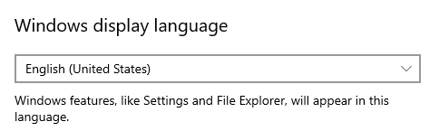  

6. Go to Settings | Language | Region, click Regional format and select “English (United States)”.    

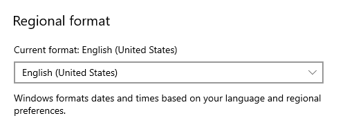  

7. Done. You have changed your language to English. Congratulations!~  

  

### Microsoft Teams 

1. Navigate to Microsoft Teams | Manage account

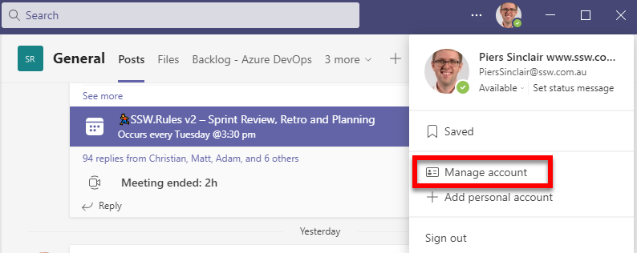

2. Navigate to General | App language and then select English from the dropdown.

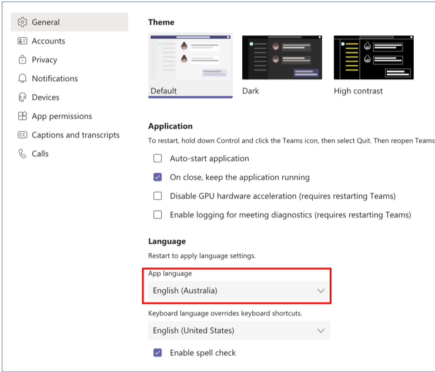

3. Done!
