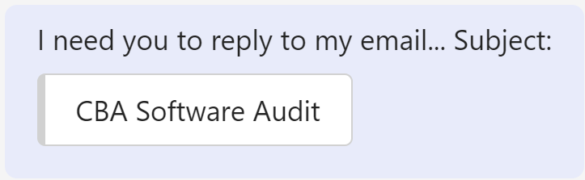

Use IM to chase up that important email. You can make it easy for everyone (or at least give them the context of your questions) by pasting the email subject.

::: greybox
I sent you an email just now, please approve

:::

::: bad
 **Figure: Bad example - client need to filter his emails manually**

:::

::: greybox
I need you to reply to my email... Subject: CBA Software Audit

:::

::: good
Figure: Good example - client can search your email based on the subject

:::

### Tip: Use text formatting

To make your messages more visually appealing, you can use "> {{ MESSAGE }}" in Microsoft Teams chats to highlight your message as a quote. This works particularly well when you want to refer to an email subject, i.e:

::: good  

:::

<!--endintro-->
