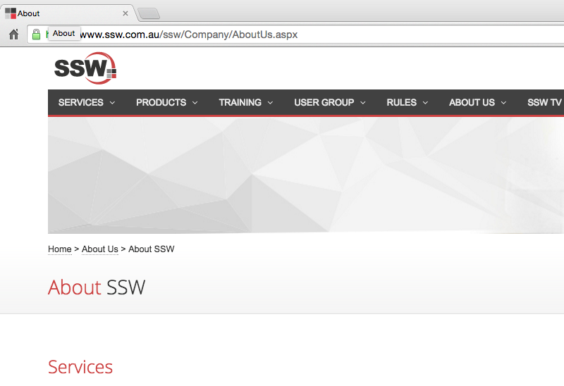

​​The <b>&lt;title&gt;</b>, <b>&lt;h1&gt;</b>, and <b>&lt;h2&gt;</b> tags need to be descriptive. They should briefly describe the purpose or content of the page. Have a look at the following two images. The first image is a bad example as the title bar and page heading are not very descriptive. The second image is a better example as title bar and page heading are more informative.​

 <excerpt class='endintro'></excerpt> 
<dl class="badImage"><dt>
   ​​​</dt><dd>Figure: Bad Example - non-descriptive title/headings​</dd></dl><dl class="goodImage"><dt> 
       
   </dt><dd>Figure: Good Example - descriptive title/headings​</dd></dl>
We have a program called 
   <a href="http://codeauditor.com/" target="_blank">SSW Code Auditor​</a> to check for this rule.

We have a program called 
   <a href="https://sswlinkauditor.com/" target="_blank">SSW Link Auditor​</a> to check for this rule.
​

