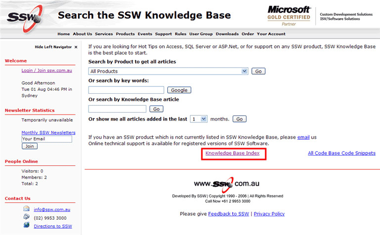
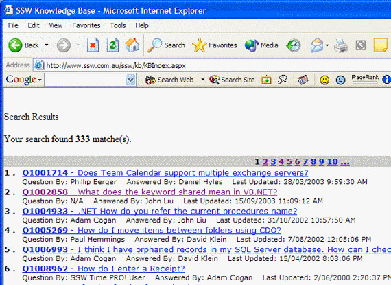

Google crawls data-driven websites. There are a few considerations when it comes to optimizing a data-driven website. The best way to get your database-driven website crawled by Google is to have an index of your dynamic pages so that the Google bots have a singular point of reference to your dynamic pages. It's a slow process, but it will be well worth it.

<!--endintro-->

Take a look at how we tackle this issue. We have a knowledge base with hundreds of pages and we list them all here on our Knowledge Database index page. We know that Google has crawled them because it shows up on Google results. We applied a [sitemap](https://support.google.com/webmasters/answer/156184?hl=en).

  

