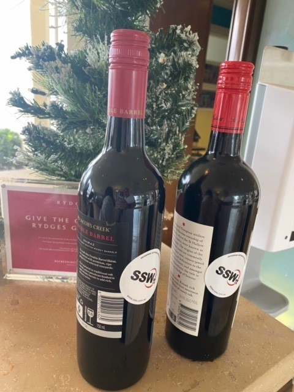

If you get a physical gift (e.g. wine bottle or a hamper), you can add stickers on the gifts for better branding. In case you go for a virtual gift, e.g. an e-voucher (usually sent via email), you can also add your logo to it.

::: greybox
**Tip:** remember to make your gift extra special! You should personalise it by purchasing something for your client related to a hobby, for example.
:::

<!--endintro-->

