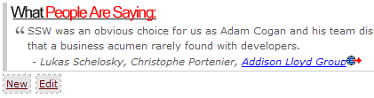
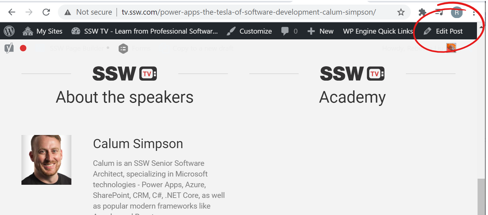

I​f you have database driven pages on your website, you need a way of updating the data quickly and easily. 
<strong>Each page should have an 'Edit' link</strong> - only visible when the site is running internally or in administrator mode - that takes you directly to the page for editing the content on that page. 
 
The exception to this is if you are using open-source data.​ ​​<a href="https://ssw.com.au/people/">SSW.People</a> is a good example of this.​ 
 <excerpt class='endintro'></excerpt> 
<dl class="ssw15-rteElement-ImageArea"><dt>
      
   </dt><dd>
      <strong>Figure: "New" and "Edit" links allow SSW Employees to maintain testimonial entries easily</strong></dd></dl>
  
<dl class="ssw15-rteElement-ImageArea"><dt>
      
   </dt><dd>
      <strong>Figure: "Edit" button on WordPress admin bar</strong></dd></dl>​  
<dl class="ssw15-rteElement-ImageArea"><dt>
      
   </dt><dd class="ssw15-rteElement-FigureGood">​Figure: Good Example - "Edit" button on an Open Source page​ </dd></dl>
From Github, you can edit and submit a pull request. See 
   <a href="https://github.com/SSWConsulting/SSW.People.Profiles/wiki">https://github.com/SSWConsulting/SSW.People.Profiles/wiki​</a> (SSW People) or <a href="https://github.com/SSWConsulting/SSW.Rules.Content/wiki">https://github.com/SSWConsulting/SSW.Rules.Content/wiki</a> (SSW Rules) for more details. 

​This is better than sending a 'Change from X to Y' email (<a href=/do-you-ask-for-content-changes-using-from-x-to-y>http://rules.ssw.com.au/do-you-ask-for-content-changes-using-from-x-to-y</a>) as the work can be done immediatel​y with less work and management requirements. 
<h3>Related Rule​ </h3><dl class="ssw15-rteElement-ImageArea"><dt>
      
   </dt><dd>
      <strong><a href=/using-github-and-markdown-to-store-you-content>Do you use Markdown t​​​​o store your content?</a></strong>​ </dd></dl>​ 

