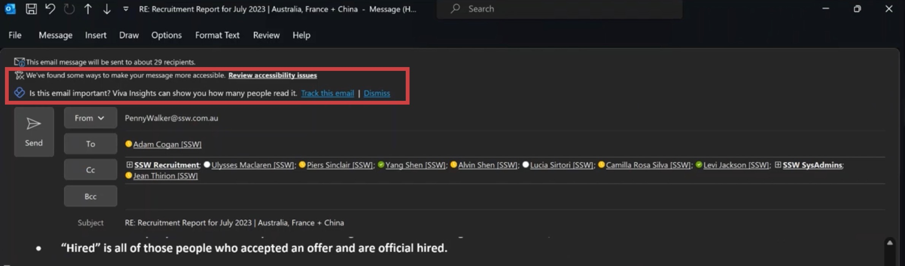
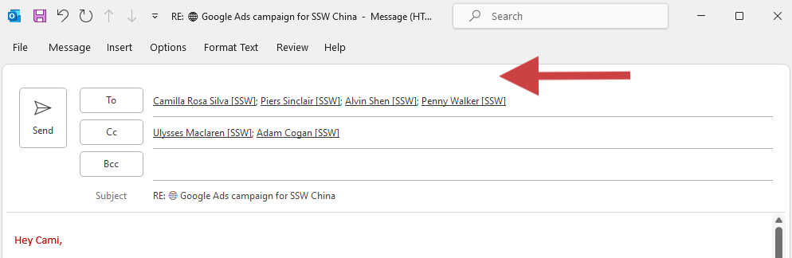

For a great 'Done Video' here are the key things to remember:

<!--endintro-->

1. **Generic** - Keep your video appealing and easy to understand for a global audience.
2. **Prepare** - Plan what you're going to say and open the browser tabs you'll show beforehand. This means you should practice what you're going to say, especially your Intro and Outro!
3. **Apparel** - If your company has branded clothing, make sure it's ironed, tidy and visible. Wear it proudly! Alternatively, wear clean, neutral color clothing. E.g. White, grey, or black shirt
4. **Framing** - Have your webcam height at eye level for engagement. Make sure there is sufficient headroom: not too little (don't cut off the top of your head in the frame) and no too much (the subject needs to fill the frame). Ensure your branded clothing is visible and the background is clean and tidy.
5. **Lighting** - Ensure there is optimal room lighting and facial brightness. Consider a ceiling-pointing lamp for additional light. Avoid intense backlights to prevent silhouetting.
6. **Introduction** - Start by introducing yourself and what you will be talking about. E.g. *"Hi everyone, today I would like to show you..."*
7. **Ending** - Finish with a strong closing that summarizes what you talked about.
8. **Show the Pain** - Demonstrate the problem that your new feature will fix, then demonstrate your feature.
9. **One-Take** - Record it in one take, but start again if it's super bad. If something out-of-your control happens, try to be natural! If you mistype a word or click the wrong button, don't freak out and start again, incorporate it. E.g. *"Whoops, clicked build accidently. Let me just refresh and go again."*\
   Note: If your video is short (1-2 mins), then starting again may be optimal. However, if your video is long. E.g. 15-20 minutes, then try to incorporate any accidental errors and keep going.
10. **Quick** - Keep it short, concise, and don't repeat yourself!
11. **Directing Attention** - Give people an idea of where to look by mentioning positions on the screen before taking actions. E.g. *"At the bottom of the screen" or "in the top right-hand corner."*
12. **Presentation** - present data from X to Y. E.g. for financial data start with the last month and then show the current month.
13. **Clean UI** - Use a clean browser and IDE or hide your bookmarks bar, and zoom in to 125% in your browser. Hide the ribbon if presenting in Microsoft Office. Clear all irrelevant reminders if presenting in Outlook.\
    Note: You can easily get a clean browser by using a guest or incognito profile.

::: bad

:::

::: good

:::

13. **Resolution** - Set your screen to 1080p (1920x1080).
14. **Recording** - Record both your screen and webcam.
15. **Audio** - Check your audio devices for the best quality and make sure your audio is clear and not distracting. E.g. Position the microphone close to your mouth.
16. **Be Friendly** - Interact with your webcam like it's a person, and smile at the Intro and Outro.
17. **No Edits** - Don't edit the video; use a picture-in-picture format and hotkeys to switch visuals.
18. **Do a Test Recording** - After all this effort to capture a great video this can catch any last-minute changes and cut down on potential re-recordings. E.g. Test your Intro hook and screen transitions.

Remember to watch some "Done" videos to get an idea of what a good "Done Video" looks like!

`youtube: https://www.youtube.com/embed/CjwkGk1LcJ0`
**Video: Make a Quick and Dirty "Done" video in Camtasia (2 min)**
