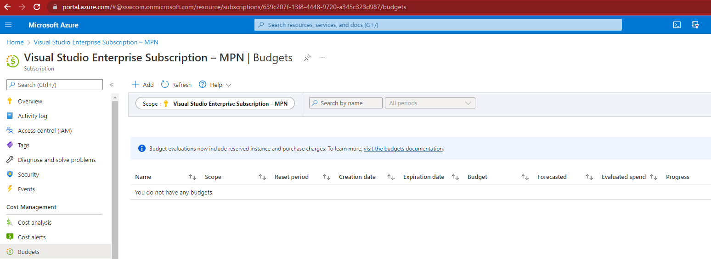
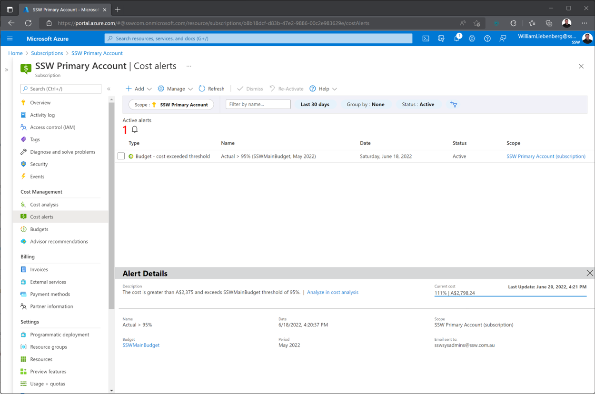

Azure costs can be difficult to figure out and it is important to make sure there are no hidden surprises. To avoid bill shock, it is crucial to be informed.

There are various cost management tools that help keep Azure costs in line.

<!--endintro-->

### Budgets

Budgets are a tool that allow users to define how much money is spent on either an Azure Subscription or a specific resource group.

It is critical that an overarching budget, is set up for every subscription in your organization. The budget figure should define the maximum amount expected to be spent every month.

In addition to the overarching budget, specific apps can be targeted to monitor how much is being spent on them. Each time a new service is proposed, it is a good idea to have a cost conversation and create a new budget to monitor that app.

::: bad

:::

::: good

:::

### Cost Alerts

Once a budget is set up, cost alerts are the next important part for monitoring costs. Cost alerts define the notifications that are sent out when budget thresholds are being exceeded. For example, it might be set to send out an alert at 50%, 75%, 100% and 200%.

Make sure to set up alerts on all the thresholds that are important to the company.

If the company is really worried about costs, an Azure runbook could even be set up to disable resources after exceeding the budget limit. However, that isn't a very common practice since nobody wants the company website to go down randomly!

::: bad

:::

::: good

:::