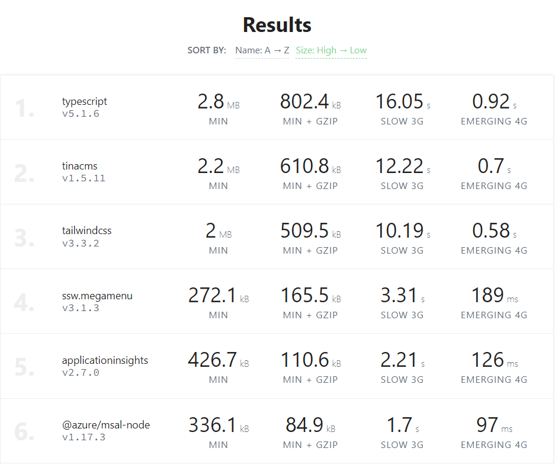
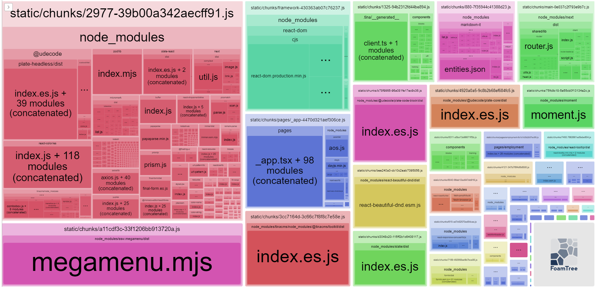

Shipping a large JavaScript bundle can be catastrophic for your web app - resulting in longer load times and a poor user experience using a web app. It is very easy for this to be the case when using a web framework such as React or Angular, as adding packages to an already large amount of framework code can result in a bloated JavaScript bundle. 

<!--endintro-->

Despite the efforts made by tools like [Webpack](https://webpack.js.org/), [Rollup](https://rollupjs.org/) or [Vite](https://vitejs.dev/) to optimize your JavaScript bundle, these may not be sufficient if your project has an excessive number of NPM packages. Each package introduces additional code to your bundle, and unnecessary or redundant packages can quickly inflate its size. Identifying and eliminating such packages can help keep your bundle lean and efficient. Here are some tools that can help with this process:

## depcheck

Depcheck is a great CLI tool that scans your project to automatically detect unused dependencies in a project, giving you a clear and concise list of unused packages in a repository. 

```shell
npx depcheck
```


**Note:** It is important to be mindful when using this tool of packages that are still in use in the project, either in the build steps or otherwise (e.g. `tailwindcss` in the example above is not explicitly imported in the project, but is still used behind the scenes).

## Bundlephobia

Bundlephobia is a great tool for quickly seeing the bundle size of NPM packages. You can find the bundle size of any NPM package by going to the URL: bundlephobia.com/package/{{ PACKAGE_NAME_HERE }}. 

You can also upload a package.json file to display a list of packages in your project, allowing you to easily see which NPM packages have the largest size in the project. You can find it at [bundlephobia.com/scan](https://bundlephobia.com/scan).




**Note:** It is important to understand that not all of the packages in your `package.json` file are shipped to the client, this is primarily a tool used to assess specific client-side packages that you suspect may have a large bundle size (for example, some packages may only be used by the server or within the build steps of the project i.e. `typescript` or `tailwindcss`). 

## Import Cost VSCode Extension

The Import Cost extension for VSCode, developed by Wix shows the size of each NPM package you import, which can provide useful visual feedback on how large the packages you importing actually are. You search the extension on the Visual Studio Code Extension Marketplace at [Import Cost](https://marketplace.visualstudio.com/items?itemName=wix.vscode-import-cost). 


## Webpack Bundle Analyzer 

If your JavaScript project is using Webpack (most React/NextJS projects will be), you can use the NPM package [`webpack-bundle-analyzer`](https://www.npmjs.com/package/webpack-bundle-analyzer) to easily visualise the size of the NPM dependencies contained in the client bundle. 


If you are using NextJS, it is advised to use Next's custom implementation of the package - [`@next/bundle-analyzer`](https://www.npmjs.com/package/@next/bundle-analyzer).


