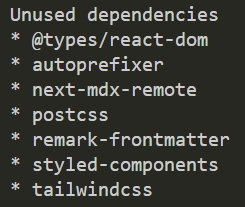
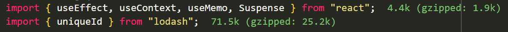

Having a large bundle size can be catastrophic for your web app - resulting in longer load times and a poor user experience when using your web app. It is very easy for this to be the case when using a featured web framework such as React or Angular, as adding packages to an already large amount of framework code can result in a bloated JavaScript bundle. 

<!--endintro-->

Tools like [Webpack](https://webpack.js.org/), [Rollup](https://rollupjs.org/) or [Vite](https://vitejs.dev/) can help with reducing the amount of JavaScript shipped to the end-user. However, even if we have used these tools it may still be necessary to minimise the number of NPM packages in the project.

## depcheck

Depcheck is a great CLI tool that scans your project to automatically detect unused dependencies in a project, giving you a clear and concise list of unused packages in a repository. 

```shell
npx depcheck
```



## Bundlephobia

Bundlephobia is a great tool


[here](https://bundlephobia.com/)

## Import Cost VSCode Extension

The Import Cost extension for VSCode, developed by Wix shows the size of each NPM package you import, which can provide useful visual feedback on how large the packages you importing actually are. You can find the extension [here](https://marketplace.visualstudio.com/items?itemName=wix.vscode-import-cost). 




## Webpack Bundle Analyzer 

[ding dong](https://www.npmjs.com/package/webpack-bundle-analyzer)


For NextJS: [ding](https://www.npmjs.com/package/@next/bundle-analyzer)