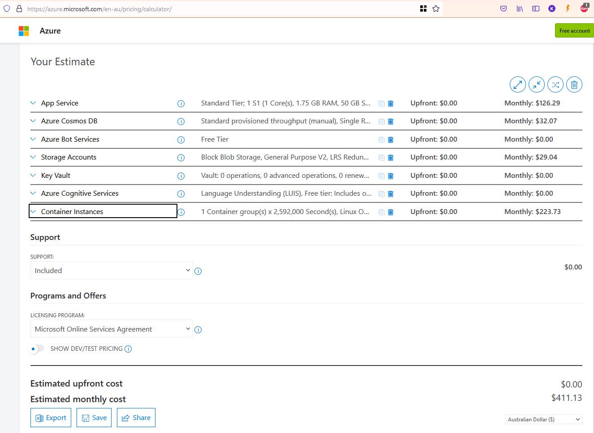

Managing the monthly spend on cloud resources eg. Azure is hard. It gets harder for SysAdmins when developers add services without sending an email to aid in reconciliation.

<!--endintro-->

Azure has a nice tool for managing its own costs, called the Cost Analysis - https://docs.microsoft.com/en-us/azure/cost-management-billing/costs/quick-acm-cost-analysis \
You can break down costs per resource group, resource type and many other aspects in Azure.

Note: If your subscription is a Microsoft Sponsored account, you can't use the Cost Analysis tool to break down your costs, unfortunately. Microsoft has this planned for the future, but it's not here yet.

Even with Cost Analysis, Developers with enough permissions (e.g. Contributor permissions to a Resource Group) are able to create resources without the spend master (generally the SysAdmins) knowing, and this will lead to budget and spending problems at the end of the billing cycle.

For everyone to be on the same page, the process a developer should follow is:

1. Use the Azure calculator - work out the monthly resource $ price\
   https://azure.microsoft.com/en-au/pricing/calculator
2. Email SysAdmins with $ and a request to create resources in Azure, like the below: 

::: email-template  
|          |     |
| -------- | --- |
| To:      | SysAdmins |
| Subject: | Purchase Please - Azure Resource Request for xx |  
::: email-content  

### To SSWSysAdmins,

I would like you to provision a new Azure Resource

1. Azure Resource needed: I would like to create a new App Service Plan 
2. Azure Calculator link: https://azure.com/e/f41a4bdd0d2d4b67b7bcb5939adbc22f
3. Environment eg. Dev/Staging/Prod: Prod

For what project? 

4. Project Name: A new project called SSW.Northwind 
5. Project Description (The SysAdmin will copy this info to the Azure Tag):
6. Project URL eg. Azure DevOps / Github: https://github.com/SSWConsulting/SSW.Rules.Content

Total: A$411 per month 

Please approve

David

<As per SSW Rule: https://www.ssw.com.au/rules/manage-costs-azure>

:::  
:::  
