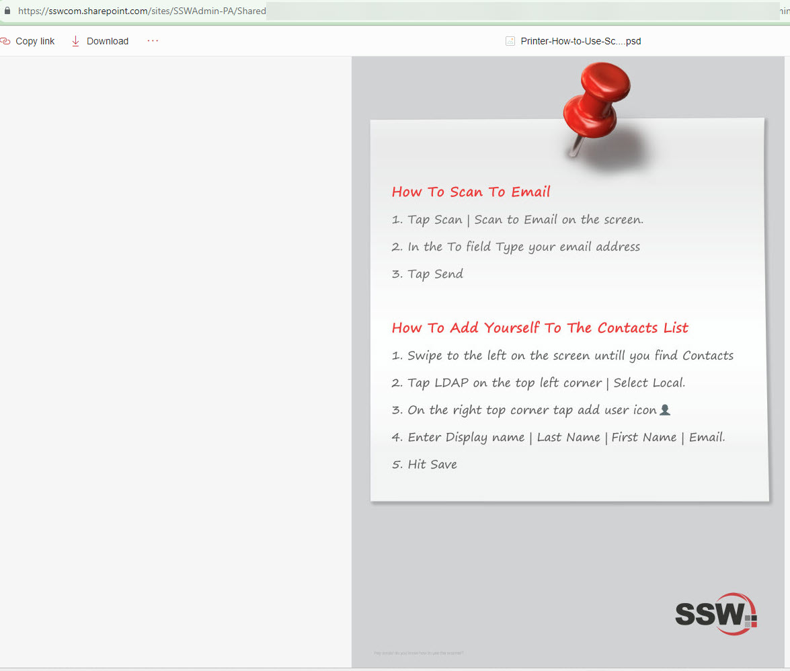
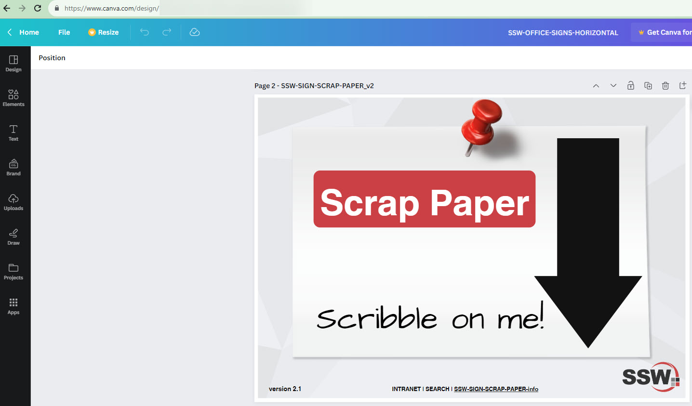

When it comes to creating custom designs or templates for office purposes, using a dedicated designer application can greatly enhance the quality and professionalism of your designs. While there are various designer applications available, it's important to choose the right one that aligns with your needs and skill level.

<!--endintro-->

Using Adobe Illustrator or Photoshop for non-designers can be time-consuming and challenging. These tools require a steep learning curve and are tailored toward professionals in the design industry. Non-designers might struggle with complex functionalities and intricate workflows, leading to inefficient use of time and resources.

### Why Choose Canva for Signage Design by Non-Designers

Canva is a user-friendly design tool that doesn't require extensive design knowledge. It provides pre-made templates, drag-and-drop functionality, and a wide range of design elements. It's perfect for non-designers who want to create professional-looking signs with ease!

Canva is a web-based platform accessible from any device with an internet connection. This ensures that employees can work on their designs from different locations and collaborate seamlessly.

Canva supports real-time collaboration, allowing multiple users to work on the same design simultaneously. This is particularly useful when creating shared signage templates.

### Creating and Sharing Signage Templates

To ensure a standardized approach to creating and sharing signage templates, follow these steps:

#### Design Creation

* Start by selecting an appropriate template in Canva for the desired signage type.  
* Customize the template with relevant content, branding elements, and visuals.  
* Incorporate a strong header and footer as per the [SSW's design rule](/have-a-strong-header-and-footer/).  
* Include a version number following [SSW's version number rule](/show-version-numbers/).  

#### Duplication and Review

* Once the initial design is complete, create a duplicate of the design within Canva.
* Make necessary changes to the duplicated design while adhering to your requirements.  
* Before finalizing, it's important to get the duplicated design checked and approved by a designated reviewer as per the [Checked by rule](/checked-by-xxx/).

#### Storing and Sharing

* Store the approved designs in an accessible location, such as a SharePoint repository.  
* Share the repository link with all employees who need access to the templates.

:::bad

:::

:::good

:::
