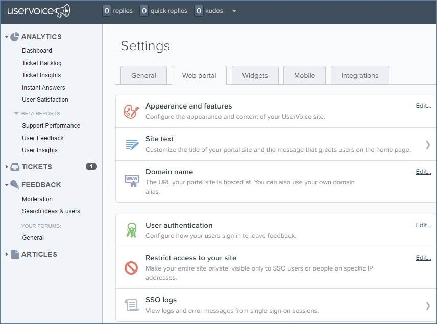

How do you want customers to send you feedback? Phone calls? Emails? A website?
There are a plenty of web applications to choose from, but one that is a clear winner.

<!--endintro-->

In the past we had a couple of main options:

* [UserVoice](https://www.uservoice.com/)
* [UserEcho](https://userecho.com/)

::: bad

:::

::: bad

:::

[UserVoice](https://www.uservoice.com/) was as popular platform to collect, manage, and prioritize user feedback. It has a voting and tickets system out of the box.

Many software houses used this for their products Eg. SSW CodeAuditor, SSW LinkAuditor, etc

::: good
The best options for managing product feedback is GitHub.

If a user needs some support, or wnats to suggest changing the way something works (e.g. reversing a default), then they should use **GitHub Discussions.**
See our rule: [https://www.ssw.com.au/rules/use-github-discussions/](https://www.ssw.com.au/rules/use-github-discussions/)

If a user wants to report a bug or suggest a new feature, then they should use **GitHub Issues.**
:::

