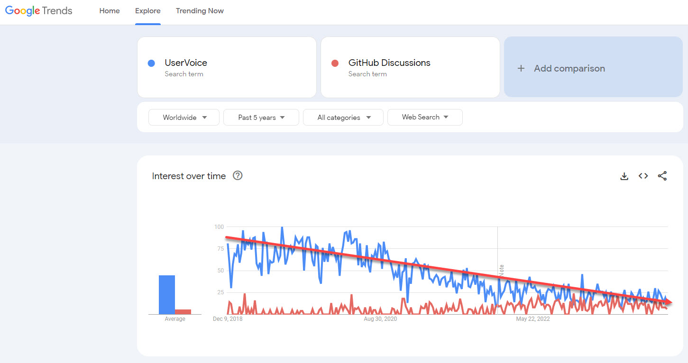

Effectively managing product feedback is key to improving your product. While platforms like UserVoice and UserEcho have been popular, GitHub emerges as a superior choice for modern software development.

<!--endintro-->

### UserVoice and UserEcho

* **[UserVoice](https://www.uservoice.com/)** - Known for its voting and ticket system, it allows users to enter suggestions and administrators to track feedback
* **[UserEcho](https://userecho.com/)** - Similar to UserVoice, providing a platform for user feedback and suggestions

### Why GitHub is Better

* **Integrated Development Workflow**: GitHub integrates directly with your development workflow, making it easier to turn feedback into actionable items
* **Transparency and Collaboration**: GitHub's open platform fosters transparency and collaboration, allowing users to see the progress of their feedback
* **Richer Interactions**: Beyond simple voting, GitHub allows for richer interactions between developers and users through comments, labels, and reactions

### Using GitHub for Feedback Management

* **[GitHub Discussions](/use-github-discussions/)** - For general feedback or discussions around feature or support requests. Facilitates community engagement and broader discussions.
* **[GitHub Issues](/github-issue-templates/)** - Ideal for reporting bugs or tracking work. Use labels to manage and prioritise feedback effectively.
* **[Project Boards](/scrum-in-github/)** - Use GitHub Project Boards to track the progress of feedback implementation, providing visibility to your team and users.

::: good

:::

**Link:** [github.com/vercel/next.js/discussions/categories/ideas](https://github.com/vercel/next.js/discussions/categories/ideas)

GitHub’s comprehensive tools provide a more integrated and transparent approach to managing product feedback, making it the recommended choice for software teams.
[UserVoice](https://www.uservoice.com/) was as popular platform to collect, manage, and prioritize user feedback. It has a voting and tickets system out of the box.

### More Information - Google Trends

