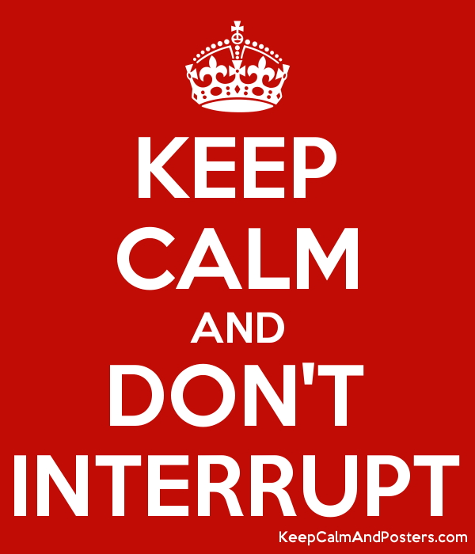
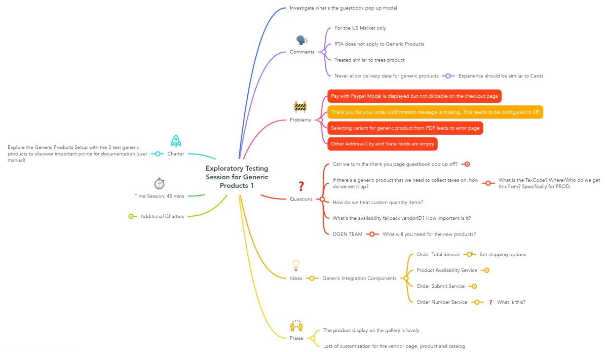

Exploratory Testing (ET) gives the tester much more freedom and responsibility in their testing than when following a more scripted approach. 

Putting some structure around ET helps to make the approach more credible and provides a way for managers to track and review testers' work.

Session-based test management (SBTM) is a lightweight approach to the management of exploratory testing effort that defines a set of expectations for what kind of work will be done and how it will be reported. 

> [SBTM is] a way for the testers to make orderly reports and organize their work without obstructing the flexibility and serendipity that makes exploratory testing useful
>     - Jon Bach

<!--endintro-->

### Testing in sessions

The "session" is the basic unit of work in exploratory testing (and not, for example, a test case or bug report).

::: greybox
A "session" is an uninterrupted and timeboxed period of reviewable, chartered test effort
:::

Breaking this down:

* By "uninterrupted," we mean no significant interruptions, no email, meetings, chatting or telephone calls (90 minutes is a common length for such an uninterrupted session - any longer and interruption is almost inevitable).
* By "timeboxed," we mean a fixed amount of time after which the session ends, whether the testing is complete or not (60-90 minutes works well as a timebox).
* By "reviewable," we mean a report, called a session sheet, is produced that can be examined by a third-party (such as the test lead/manager) that provides information about what happened.
* By "chartered," we mean that each session is associated with a mission - what we are testing or what types of problems we are looking for (such charters are descriptive but not prescriptive, and kept short, a couple of sentences at most).

### Defining charters

Charters are designed to set the mission for some testing. They should guide the tester without being prescriptive about what they should do. A good template for structuring charters comes from Elisabeth Hendrickson:

::: greybox
Explore (target) with (resources) to discover (information)
:::

Some examples of charters using this template are:

::: greybox
Explore the payment flow with different sequences of events to discover problems with transactions

Explore the chat state model with a random walk of events and transitions to discover surprises

Explore the new security system with existing system capabilities to discover possible privilege escalation risks
:::

The testing for a charter will be in sessions, possibly multiple sessions depending on the scope of the charter and what's discovered during the testing.

### Managing tester time

It is acknowledged that there are many non-testing distractions throughout the working day (e.g. meetings, email, and other important - and unimportant! - activities), so typically SBTM allows for 4-5 hours of "on session" time per day for each tester. In this way, we allow for non-testing activities and also leave time for the very important post-session debriefing (see below).

### Session reporting via session sheets

Lightweight reporting is a key part of SBTM. 

While we want to know what happened during a test session, we don’t want the reporting to be too much of a burden - aim for more time testing and less time writing about testing. 

The **session sheet** is the output artifact from a session and this is designed to be a very simple, standard way of reporting what happened during a session, with a focus on "just enough" detail for debriefing and historical reference, but not too much detail that the tester spends most of their time writing about the session. 

An example of a session sheet template can be found in Michael Bolton's [An Exploratory Tester's Notebook](https://www.developsense.com/presentations/2007-10-PNSQC-AnExploratoryTestersNotebook.pdf). 

:::greybox
**Tip:** Store your session sheets in the same place as your other project documentation. For example, if your user stories are in Azure DevOps, then add your session sheets to Azure DevOps and link them to the user story so that it's very easy to see the testing that was performed for a particular story.
:::

A few simple metrics are captured in the session sheet, often referred to as the "TBS” metrics:

**T** - Percentage of session time spent on test design and execution

**B** - Percentage of session time spent investigating problems (bug reporting)

**S** - Percentage of session time spent setting up for testing (anything else testers do that makes the first two tasks possible, including tasks such as configuring software & hardware, locating materials, reading manuals, or writing a session report)

These metrics are rough percentages! They are not meant to be accurate to the minute but more designed to reveal whether testing is being blocked by setup problems or overly buggy software not worthy of testing yet.

Apart from the task breakdown metrics, there are three other major parts of the session sheet: bugs, issues, and notes:

* Bugs are concerns about the quality of the product, along with their identifiers in the bug tracking system
* Issues are questions or problems that relate to the test process or the project at large, ready for discussion during debriefing.
* Notes are a free-form record of everything else. Notes may consist of test case ideas, function lists, risk lists, or anything else related to the testing that occurs during the session. It is the notes that provide "just enough" detail about the testing in the session. Mind maps are sometimes used instead of wordy notes as a visual representation of the test effort and the thought processes of the tester.

This mindmap is an example of how session notes could be recorded:

### Debriefing

A very important - and often overlooked - aspect of SBTM is the idea of session debriefing. 

At the end of each session, the tester gets together with someone else (e.g. their manager or another stakeholder) to talk about the session. James Bach has a handy [debriefing checklist](https://www.satisfice.com/download/sbtm-session-report-checklist) to help you ask the right questions during debriefing.

The basic idea of the debriefing is to tell the story of the testing that was done, see what issues or questions arose, and think about charters for further sessions (if required). Debriefing can also be used as an opportunity to provide feedback and coaching to the tester.

This crucial information-gathering exercise is designed to be brief, a maximum of 15 minutes, and omitting these debriefings really does miss out on one of the core aspects of successful SBTM, so resist the temptation to cut this corner. (As testers gain more experience in performing ET in sessions, several related sessions might be covered in the same debriefing.) 

The debriefings also help us to learn how much can be done in a test session, and by tracking how many sessions are actually done over a period of time, we gain the ability to estimate the amount of work involved in a test cycle and predict how long testing will take even though we have not planned the work in detail.

### Metrics & reporting

Session metrics are the primary means to express the status of the exploratory test effort. They can include the following elements:

* Number of sessions completed
* Number of problems found
* Functional areas covered
* Percentage of session time spent testing (the "T" in "TBS", test design & execution)
* Percentage of session time spent investigating problems (the "B" in "TBS", bug investigation & reporting)
* Percentage of session time spent setting up for testing (the "S" in "TBS", session setup)

A mindmap is also a handy way of reporting on coverage, by using a map of the product and highlighting areas that have been tested, have not been tested, or have significant problems. This visual presentation of test coverage is much easier for stakeholders to interpret than a long wordy document or complex spreadsheet.

### Tips for getting started

* If you are currently running testing from scripted test cases, try using SBTM by having charters for the target of each test case and then running sessions, rather than following the exact steps of the test case.
* Once you become familiar with managing your test effort in sessions, try reporting your test results using an SBTM approach too (keeping any existing reporting requirements in place if need be) and educate consumers of your test reporting as to their content.
* During Sprint planning, consider estimating how many sessions will be required for each story allocated in the Sprint. Knowing how many testers you have available and how many sessions each tester can reliably complete per day, you can calculate your "tester velocity" (in terms of number of sessions per Sprint) to see whether you can realistically complete the testing of the stories within the Sprint timeframe. This early signal is helpful in not committing too much work to the Sprint and reinforces the idea that stories are not finished unless they are also well tested.

### Further reading

* ["Session-based Test Management" paper](http://www.satisfice.com/articles/sbtm.pdf) by James Bach
* [Session-based Test Management](http://www.satisfice.com/sbtm/) by Jon & James Bach
* [Exploratory Testing **IS** Accountable](http://www.developsense.com/blog/2010/01/exploratory-testing-is-accountable/) by Michael Bolton
* [Mind map: What is SBTM and how is it applied?](http://qastuff.wordpress.com/2012/08/17/what-is-exploratory-testing-and-how-is-it-managed/) by Carl
