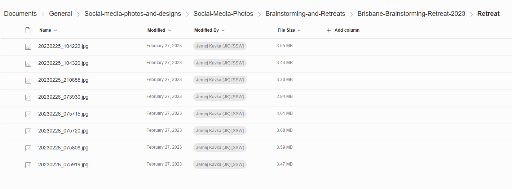
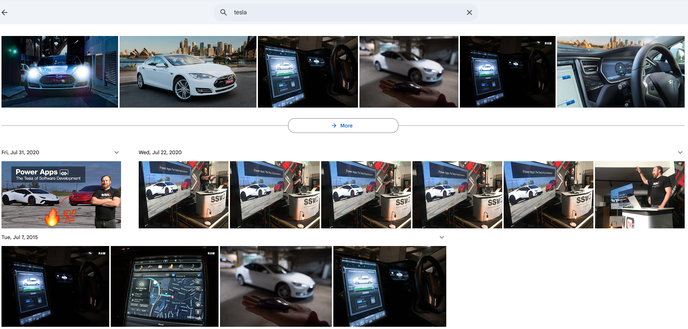

Have you ever wasted time searching through disorganized photo folders or lost images when a team member leaves? Managing images poorly can be costly and frustrating.

Google Photos offers a practical way to organize and find your images with ease. Using features like automatic sorting, facial recognition, and powerful search tools, it helps you quickly locate specific photos from your collection. Whether you're looking for a picture of a specific person, place, or event, Google Photos makes the process straightforward and efficient. This guide will explore how to make the most of Google Photos' capabilities for managing and finding your images.

<!--endintro-->

There are 3 main ways you can organise your photos using Google Photos:

### Google Photos via Links

Google Photos can be used as a repository, but it can also be used as a file-sharing tool. If you want multiple people to add photos to an album, you can create a link and share it for others to use. It's quick, easy, and doesn't require special access to your repository. 

One limitation to be aware of is that whoever uploads the photos maintains control over the image. So, if an admin or the uploader removes their access to a folder, so too are their images.

### Staging Area + Google Photos (recommended)

Inviting a lot of people to share their photos of an event with you can create curation issues. For example, an attendee might upload 50 images they've taken, but only 10 of those are good enough quality to keep.

To avoid storage space issues (everyone gets 15 GB), it is a better practice to have a 'staging area' where everyone can upload their photos, allowing them to be curated, and only the best ones can then be uploaded to Google.

You could use SharePoint or a file server for this purpose, making it the most versatile approach. 

### File Server as a staging area  + Google Photos

If you use a file server as your staging area, it is then possible to use a Google Drive to upload files to your Google Photos storage automatically. It takes a little more time to set up, but it saves you time in the long run! 

Unfortunately, changes made in September 2024 mean that the Google Photos API now has some limitations - it's not great at doing integrations from cloud to cloud.\
 See [https://developers.googleblog.com/en/google-photos-picker-api-launch-and-library-api-updates](https://developers.googleblog.com/en/google-photos-picker-api-launch-and-library-api-updates/) for more. 

Watch the video to know more:

`youtube: https://www.youtube.com/embed/p8_siTdeeCg`

### Related suggestion to Google Photos

* [Let me know my account doesn’t have access instead of a 404](https://bettersoftwaresuggestions.com/google/google-photos/let-me-know-my-account-doesnt-have-access-instead-of-a-404/)
