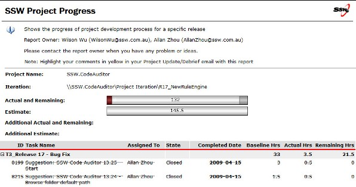

 
  
Every week&#160;the project manager should meet with the client to conduct an external &quot;Test Please&quot; as well as to discuss the status of the release.  

<b>Tip #1&#58; </b>Choose the same day each week (for example SSW chooses Tuesday) 
<b>Tip #2&#58; </b>While it is better to conduct an internal &quot;Test Please&quot; before the meeting (for example SSW chooses Friday), this &quot;Release Update/Debrief Meeting&quot; should proceed (even if it hasn't been completed).

This is the agenda&#58;​​
 

  <ol>
    <li>Status of original work items - are they all done?</li>
    <li>External <a href="/Pages/InternalTestPlease.aspx">Test Please</a> - go through the application and get the clients thoughts. Many&#160;issues they&#160;see, will already be reported by the internal &quot;Test Please&quot;. Send emails to the new ones.</li>
    <li>Triage these additional work items - try to move all to the next release</li>
    <li>Approval for additional work items/budget overruns&#160;- talk $$  e.g. look at the &quot;Actual&quot; and &quot;Estimate&quot; figures on the top of the report</li>
    <li>Release sign-off - &quot;Yes&quot; or &quot;No&quot;?</li>
</ol>

If &quot;Yes&quot;

<ol>
    <li>Ask the client for a mark /10 for the release</li>
    <li>Ask the client if you can do a deployment to Production?</li>
    <li>Ask for Approval for next release &#160;</li>
</ol>

There are tools to help you do this&#58;

<ul>
    <li><a href="http&#58;//www.ssw.com.au/ssw/AgileTemplate/UserGuide.aspx#ReleaseUpdate">SSW TFS Add-in - Release Update/Debrief Report</a> </li>
</ul>
<dl class="image"> <dt> </dt> <dd>Figure&#58; The actual output of the Release Update Report </dd> </dl>

Here is a&#160;PDF format <a href="http&#58;//www.ssw.com.au/ssw/AgileTemplate/Sample/Reports.zip">SSW Release Update Report.</a>

<strong>If you are at the end of a main section of work, promote your success </strong>

<ul>
    <li><a name="Ask for a testimonial for the work you have done" id="Ask for a testimonial for the work you have done" href="/_layouts/15/FIXUPREDIRECT.ASPX?WebId=3dfc0e07-e23a-4cbb-aac2-e778b71166a2&amp;TermSetId=07da3ddf-0924-4cd2-a6d4-a4809ae20160&amp;TermId=c14a312e-5c0d-489f-80e1-8722fd99d607">Ask for&#160;a testimonial for the work you have done</a> </li>
    <li>Create a case study and get it approved - This should be a win-win for the client. E.g.&#160;<a href="https&#58;//www.ssw.com.au/ssw/Consulting/Case-Study/WorleyParsons.aspx">WorleyParsons</a> </li>
    <li>Add&#160;a link to the work you have done on your website or marketing material. E.g.&#160;<a href="http&#58;//www.ssw.com.au/ssw/Company/Clients" target="_blank">Our Clients</a> page</li>
</ul>
​

