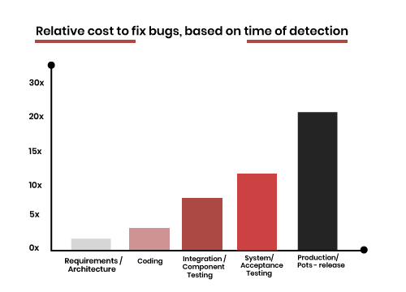

This rule has been important for a long time: Fix bugs before adding functionality.

* Bugs get more expensive as they get older
* Bugs become more complex the longer you wait to fix them
* You have better access to the developer who created it who will be able to fix it faster

<!--endintro-->

**Source:** [What is a Software Bug? Cost of bug fix!](<https://www.testbytes.net/blog/what-is-a-software-bug/>)

---

Failing to follow this rule encourages developers and creators to focus on new 'interesting' functionality which is exactly what you don't want...
You must be strong in the face of pressures from project plan scheduling!

::: info
**Note:** The principle of this bug rule can apply to more than just developers.

Let's suppose you work in Marketing and have a problem with a hypothetical report. You should fix that issue first, before adding new information to the report.
:::