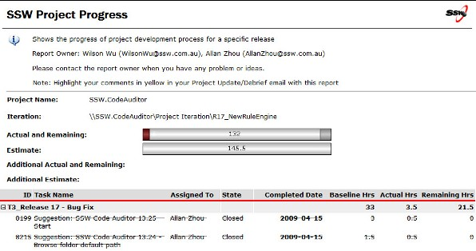

  
Every week the project manager should meet with the client to conduct an external "Test Please" as well as to discuss the status of the release.  

<b>Tip #1: </b>Choose the same day each week (for example SSW chooses Tuesday) 
<b>Tip #2: </b>While it is better to conduct an internal "Test Please" before the meeting (for example SSW chooses Friday), this "Release Update/Debrief Meeting" should proceed (even if it hasn't been completed).

This is the agenda:​​

 <excerpt class='endintro'></excerpt> 

  <ol>
    <li>Status of original work items - are they all done?</li>
    <li>External <a href="/Pages/InternalTestPlease.aspx">Test Please</a> - go through the application and get the clients thoughts. Many issues they see, will already be reported by the internal "Test Please". Send emails to the new ones.</li>
    <li>Triage these additional work items - try to move all to the next release</li>
    <li>Approval for additional work items/budget overruns - talk $$  e.g. look at the "Actual" and "Estimate" figures on the top of the report</li>
    <li>Release sign-off - "Yes" or "No"?</li>
</ol>

If "Yes"

<ol>
    <li>Ask the client for a mark /10 for the release</li>
    <li>Ask the client if you can do a deployment to Production?</li>
    <li>Ask for Approval for next release  </li>
</ol>

There are tools to help you do this:

<ul>
    <li><a href="http://www.ssw.com.au/ssw/AgileTemplate/UserGuide.aspx#ReleaseUpdate">SSW TFS Add-in - Release Update/Debrief Report</a> </li>
</ul>
<dl class="image"> <dt> </dt> <dd>Figure: The actual output of the Release Update Report </dd> </dl>

Here is a PDF format <a href="http://www.ssw.com.au/ssw/AgileTemplate/Sample/Reports.zip">SSW Release Update Report.</a>

<strong>If you are at the end of a main section of work, promote your success </strong>

<ul>
    <li><a name="Ask for a testimonial for the work you have done" id="Ask for a testimonial for the work you have done" href=/rules-to-better-software-consultants-dealing-with-clients>Ask for a testimonial for the work you have done</a> </li>
    <li>Create a case study and get it approved - This should be a win-win for the client. E.g. <a href="https://www.ssw.com.au/ssw/Consulting/Case-Study/WorleyParsons.aspx">WorleyParsons</a> </li>
    <li>Add a link to the work you have done on your website or marketing material. E.g. <a href="http://www.ssw.com.au/ssw/Company/Clients" target="_blank">Our Clients</a> page</li>
</ul>
​

