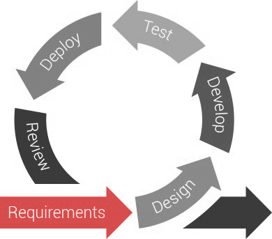

The first problem with specs is that nobody writes them. Joel Spolsky says:

> "Writing specs is like flossing: everyone agrees that it's a good thing, but nobody does it".
>
> * **Joel Spolsky,**  [The Joel Test: 12 Steps to Better Code](https://www.joelonsoftware.com/2000/08/09/the-joel-test-12-steps-to-better-code/)

The second problem is that when people do write them, they try and spec the whole project, spending months detailing every Use Case, Business Rule, and Process Flow Diagram. The client spends lots of money and sees no real progress, and the requirements change and the process begins again.

<!--endintro-->

After a long phase of planning and speccing, hand-offs between stages of a project would traditionally involve weighty documents and getting a project from start to finish could take months or years. By embracing "Emergent Architecture" and using an agile approach to project management you spec just enough, at the last responsible moment. Just-in-time speccing ensures:

* New or evolving requirements can be met.
* The ability to provide more frequent releases for frequent feedback.
* [Awesome Documentation](/awesome-documentation).
* Limited [Technical Debt](/technical-debt).

The most popular and most successful way to deliver projects is using a framework called Scrum. In Scrum, you fix the timeframe and the cost so the only variance is in the features that are delivered in that time. You should keep your time to between 2 and 4 weeks and all your team members should be full time, thus fixing the costs.

See [Rules to better Scrum](/rules-to-better-scrum-using-azure-devops).

At SSW we spec in two phases: first to get an overview of the project, and then ongoing as needed to flesh out each PBI once it is about to be added to a Sprint:

* [Spec Review](/spec-do-you-create-an-initial-release-plan-and-ballpark)
* Just-In-Time Speccing - this phase is repeated through the project
