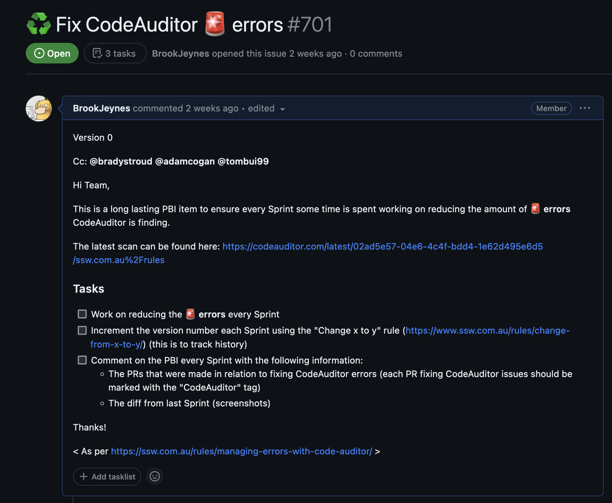

Code auditing is an essential practice that empowers developers, quality assurance teams, and organizations to identify and rectify potential flaws, weaknesses, and security risks within their codebase.

[SSW Code Auditor](https://codeauditor.com/) is the perfect tool to audit your code helping you find:

* Broken links
* HTML errors
* Google Lighthouse issues

<!--endintro-->

Every Sprint, some time should be devoted to resolving Code Auditor errors and warnings. To aid in this, long-lasting PBI items should be created and carried over each Sprint keeping a history of the work done.

The PBI should contain a version number at the top which gets incremented by +1 every new Sprint following the ["Change x to y" rule](/change-from-x-to-y/). This is used to track how many Sprints the PBI has been active for.

:::good

:::
