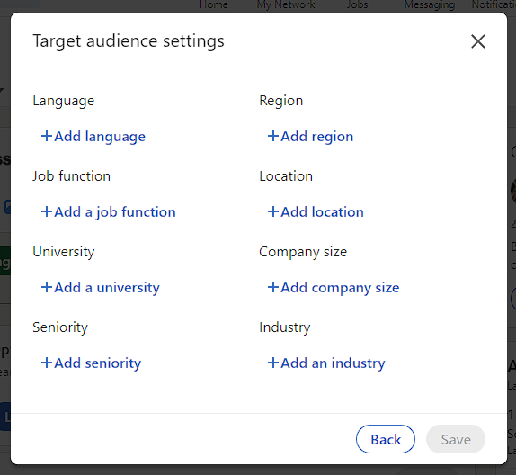
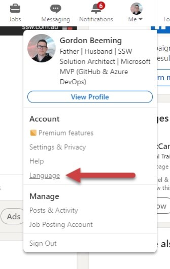
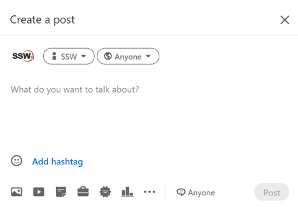
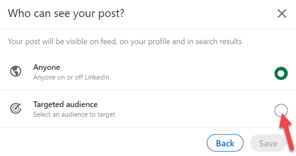
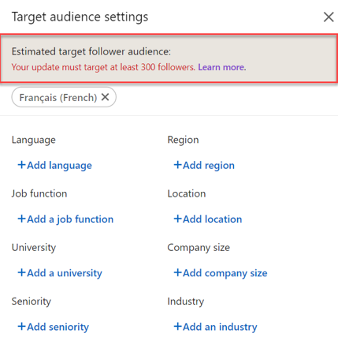
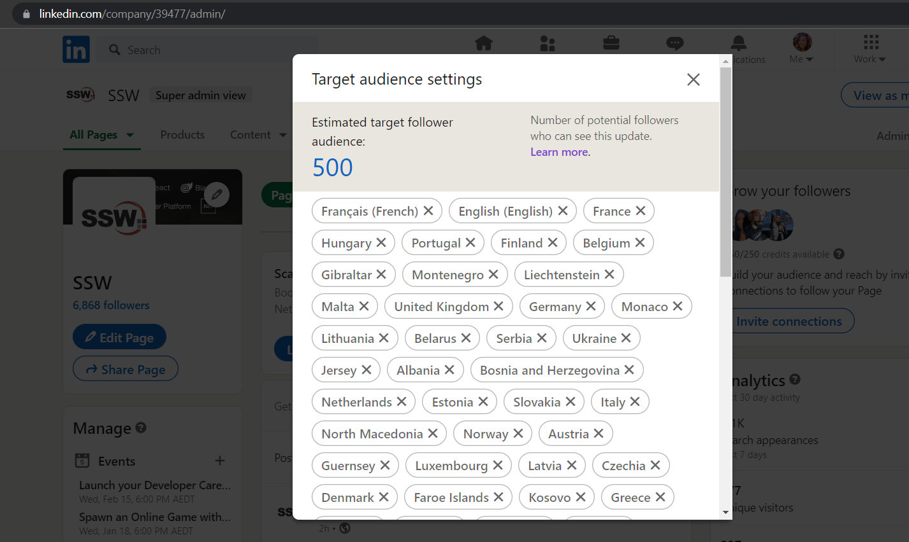
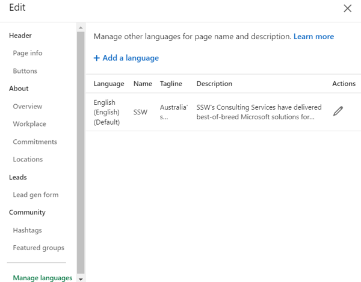

A common marketing challenge for international companies is managing social media content in different languages for a diverse audience.

LinkedIn offers many ways to customize your company's posts for audiences all over the world. One of these options is to create posts for a specific audience group based on their location and language and more.

<!--endintro-->

::: greybox
LinkedIn pages:

* Microsoft USA, Microsoft China, Microsoft France
* SSW Australia, SSW France
:::
::: bad
Figure: Bad example - Multiple LinkedIn Pages for each region
:::  

::: greybox
LinkedIn pages:

* Microsoft
* SSW
:::
::: good 
Figure: Good example - Single LinkedIn page covering all regions
:::

## Benefits of targeted, multilingual content

Here are a few valuable benefits of doing this:

✅ **Growth** – You can grow your audience in a single LinkedIn Page as opposed to starting from zero every time you add a new office location!  
✅ **Reach** – As your audience grows and so does your engagement, you will be able to reach more people and businesses  
✅ **Employment** – You will be able to advertise all the roles you are hiring for, locally and internationally, if this is your case  
✅ **Scaling up** – If your business is growing, you will be able to manage your LinkedIn presence under a single page and your business will look bigger as it grows! 

::: good

:::

## Why create targeted posts in different languages?

LinkedIn is extremely popular in North America, Europe and Asia. Having a multilingual profile can increase your online visibility and help reach existing and new clients and partners in these locations, which are also the largest and fastest-growing economies.  

## Considerations to keep in mind

When creating a multilingual LinkedIn Company page, some key elements to keep in mind are: 

* Make sure your services/products are suitable for the new audience you are targeting your content to as all markets will have their own individualities
* Ensure you are communicating the same message in all languages, and nothing is getting lost in translation
* You will need to invest in research to find out how your new audience is consuming content so you can adapt to that

## LinkedIn targeted posts in practice

### 1. Targeted Posts

Here is how you can create Targeted Company Posts: 

1. On the “All Pages” or “Home” tab of your Super or Content admin view, draft your post  

  

2. As the default setting is “Anyone”, you can adjust the privacy settings by clicking on the 🌏 dropdown & selecting the correct audience for your post 

  

  🗒️ For comment settings, click “Anyone” at the bottom of the “Create a post" window – select your preferred settings (Anyone or No one) & click save to apply your changes. 

3. Add your preferred targeting criteria on the Target audience settings Page. ⚠️Targeted posts must target a minimum of 300 Page Followers  
   **Note:** You can add up to 150 different locations!

::: bad

:::

::: good

:::

4. Click the ‘Save’ button and you are all ready to post!

### 2. New language for your company’s About

Here is how you can add new languages to your LinkedIn company page:

1. On your company page, click on ‘Edit Page’  
   **Note:** you will need to have admin access to be able to do this
2. On the left column, scroll down and you will see ‘Manage languages’

  

3. Then you can add a tagline and a description. Please note that LinkedIn does not offer all languages in the world, so you need to verify if the needed language is covered by LinkedIn 🌐
4. After adding that information, you can choose your default language and your LinkedIn company page will be ready to reach new markets! 💥
