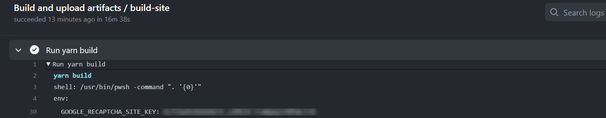
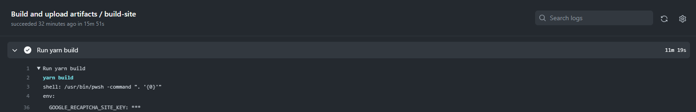

When working with GitHub Actions, there are instances where we need to pull a secret value from a CLI tool and use it within our workflow.

However, this practice can inadvertently expose the secret in the GitHub Actions logs if not handled securely. To prevent such exposure, it is crucial to redact the secret from the logs using the add-mask workflow command provided by GitHub.

This command ensures that the secret value is replaced with asterisks (\*\*\*\*) in the logs, thereby preventing any unintended disclosure of the secret.

<!--endintro-->

**Example:**

Consider the scenario where we need to retrieve a secret from Azure Key Vault (there is no pre-built action to do this from Microsoft) and use it in our GitHub Actions workflow. In the following bad example, the secret is exposed in the logs:

```yaml

- name: keyVault - Secrets
        shell: pwsh
        id: KeyVaultSecrets
        run: |

        $GoogleRecaptchaSiteKey = (az keyvault secret show --name Google-Recaptcha-Site-KEY --vault-name ${{ env.KEY_VAULT}} --query value -o tsv)
        echo "GoogleRecaptchaSiteKey=$GoogleRecaptchaSiteKey" >> $env:GITHUB_OUTPUT

```

::: bad

:::

```yaml
- name: keyVault - Secrets
        shell: pwsh
        id: KeyVaultSecrets
        run: |

        $GoogleRecaptchaSiteKey = (az keyvault secret show --name Google-Recaptcha-Site-KEY --vault-name ${{ env.KEY_VAULT}} --query value -o tsv)
        echo "::add-mask::$GoogleRecaptchaSiteKey"

        echo "GoogleRecaptchaSiteKey=$GoogleRecaptchaSiteKey" >> $env:GITHUB_OUTPUT

```

::: good

:::

For further details on masking secrets in logs, refer to the [GitHub documentation](https://docs.github.com/en/actions/using-workflows/workflow-commands-for-github-actions#masking-a-value-in-a-log).

This method ensures that while you can still use the secret within your workflow, it remains masked in the logs, mitigating the risk of accidental secret exposure.
