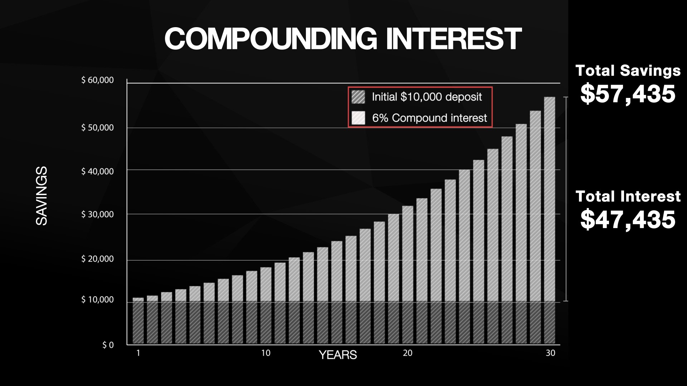
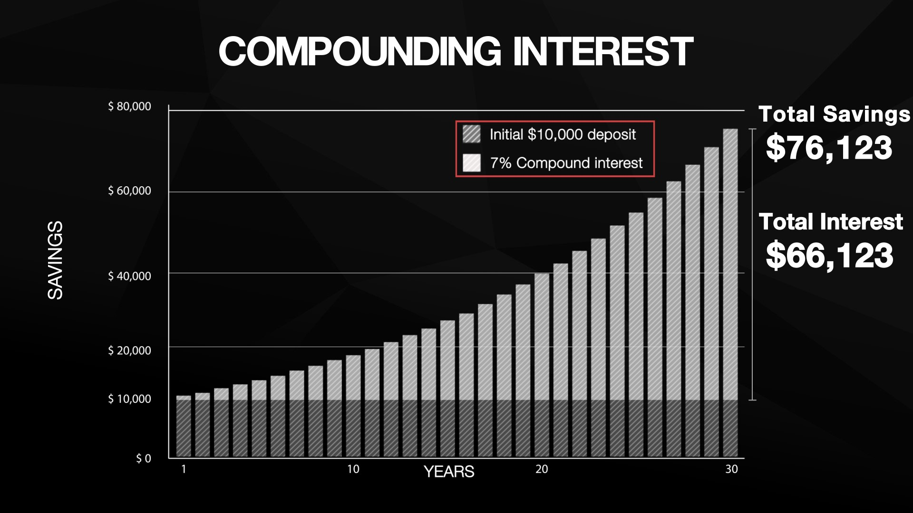
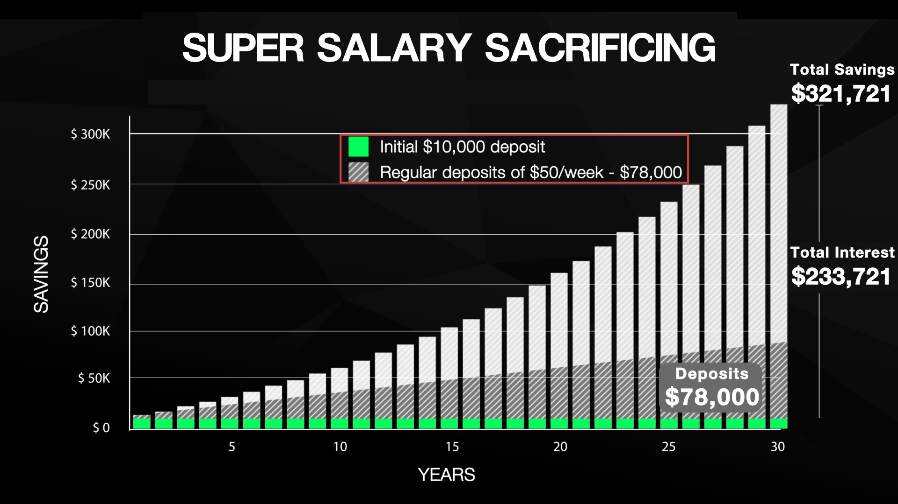

Superannuation (Super) is a compulsory retirement savings system in Australia. Your employer makes contributions on your behalf, which are invested and managed by your chosen Super fund until retirement.

Superannuation isn’t just a passive savings account — it’s an investment vehicle where your money earns interest and grows over decades.

<!--endintro-->

Let’s break it down by exploring 3 key aspects you need to understand:  

* How compounding and interest rates turn into your investment return 
* How to grow Super through salary sacrifice (going beyond mandatory) 
* How to check your Super fund is giving you strong returns

## 1. The power of compound interest

You may have heard people say that the sooner you start saving, the better off you'll be. That’s because of compound interest.

Compound interest occurs when your initial investment earns interest, and then that interest also earns interest. Over time, this snowball effect can significantly increase your returns. Since Superannuation is a long-term investment, the impact of compound interest can multiply your funds over decades.

If you would like to find out more on the types of interest, check out Investopedia’s website.

Most financial institutions will apply compounding to your investment without the need for you to explicitly ask for its activation.

### How even a small return rate difference (say 1%) impacts you?

Investment return (interest) rates play a significant role in driving the growth of your Superannuation balance over time. Even small differences in rates can have a significant impact on your retirement savings over a decade, so understanding how return rates affect your Super is crucial.

Investment return is the amount that an investment earns over time.

When investment returns are higher, your Super fund’s investments generate more returns. Compounding these returns over a decade leads to substantial growth in your Super balance.

Conversely, a lower return rate reduces the speed at which your Super balance grows. Although your investment still benefits from compounding, the overall growth is more modest compared to higher rates.

## 2. Increasing your Super balance through salary sacrifice

Another great way to boost your Super balance is to go beyond the mandatory 11.5% (FY 2025) contribution (aka Super Salary Sacrifice). This strategy allows you to contribute additional funds to your Super from your pre-tax salary.

::: info
Learn more about the [benefits of salary sacrificing](/salary-sacrifice-electronic-devices).
:::

Super Salary Sacrifice offers 2 key benefits:

✅ **Tax Savings** - Your salary sacrifice contributions are taxed at 15%, which can be up to 30% lower than your marginal [income tax rate](https://www.ato.gov.au/tax-rates-and-codes/tax-rates-australian-residents)     
✅ **Super Boost** - Extra contributions into Super lead to faster compounding growth

The important thing to remember with Super is that your contributions are subject to the Superannuation Contributions Cap. The Cap is $30,000 per year in FY2025, but it changes over time.

::: info
**Warning**: It’s essential to check the current Cap each year and consider both your employer’s contributions and any Super Salary Sacrifice contributions to avoid exceeding the Cap.
:::

## 3. How to choose the right investment option in your Super

Understanding the impact of compounding and return rates helps you compare your Super fund returns to a benchmark or assess alternate investment options.

Super funds typically offer a variety of investment choices, each with different levels of risk and return. The level of risk you're comfortable with depends on your risk tolerance - your ability and willingness to take on risk in exchange for potential rewards.

When selecting an investment option, it’s important to align your choice with both your risk tolerance and the time left until retirement. Here’s a breakdown of the most common investment options offered by Super funds:

* **Conservative** - Lower risk, lower potential returns. These investments focus on stable assets like cash and bonds
* **Balanced** - A mix of growth and conservative investments. Suitable for those with moderate risk tolerance
* **Growth/Aggressive** - Higher risk, higher potential returns. These options invest more heavily in shares and property
* **Socially Aware** - Varies in risk and returns. Focuses on ethical and sustainable investments. Best for those wanting to align investments with their values
* **Direct Investment** - Customizable risk and returns. You choose individual shares, ETFs, and term deposits. Best for experienced investors wanting control over their portfolio

### Finding the best Super fund for you

Choosing the right Super fund can make a big difference in your retirement balance. Before making any decisions, consider fees, investment options, and investment performance, etc.  

Use the [ATO's Super Comparison Tool](https://www.ato.gov.au/calculators-and-tools/super-yoursuper-comparison-tool) to compare Super funds and find one that suits your needs.

### How to rollover your Super into a different fund

Rolling over your Superannuation to a different fund can be a smart move, especially if you're looking for lower fees or better performance. The process is relatively simple, and here's how:

**1. Compare Super Funds**

Before rolling over your Super, it’s important to compare different Super funds to ensure you’re choosing the one that best fits your needs. Look for:

* **Fees** - Lower fees mean more money stays in your Super
* **Performance** - Check past performance, but remember, it doesn’t guarantee future results
* **Investment options** - Make sure the fund offers investment choices that align with your risk tolerance and goals

**Tip:** You can use the ATO Super Comparison Tool (previously mentioned) to help compare funds.

**2. Check for exit fees and insurance**

Some Super funds may charge exit fees, although many have been phased out. Additionally, check if you have any insurance attached to your existing fund, as this may not automatically transfer. Ensure your new fund offers adequate insurance coverage if needed.

**3. Rollover**

Once you’ve chosen a new fund, follow these steps to roll over your Super:

* **Log in to MyGov**: If you have a MyGov account linked to the ATO, you can initiate the rollover online
* **Complete a Rollover Form**: Alternatively, you can fill out a form provided by your new Super fund. They may also offer an online service to handle the rollover on your behalf

## Bonus: Using Super to buy your first home (Salary Sacrificed amount)

A cool thing to consider if you have never owned a property in Australia. The **First Home Super Saver Scheme (FHSSS)** allows eligible first-time home buyers to access their salary sacrificed Super contributions to help purchase a home. Here’s how it works (in FY25):

* **Eligibility** - You must be a first-time home buyer and meet the FHSSS requirements
* **Salary Sacrifice contributions** - You can access up to $15,000 of salary sacrificed Super contributions per year, and a maximum of $50,000 in total
* **Tax benefits** - Contributions are taxed at 15%, often lower than your regular income tax rate, helping you save faster
* **Withdrawal process** - You can apply to release these funds through the ATO when you're ready to buy your home
* **Timing** - You must sign a contract to buy or build within 12 months of requesting the release

This strategy can help you save for a deposit faster, while still benefiting from tax savings within Super.

Check out ATO’s website for further information on the [First Home Super Saver Scheme](https://www.ato.gov.au/individuals-and-families/super-for-individuals-and-families/super/withdrawing-and-using-your-super/early-access-to-super/first-home-super-saver-scheme).

---

## Maximize your financial future

Almost everyone gives a low care factor to their Superannuation because it is so far away. That is a mistake!

Super is more than just a retirement savings account - it's a long-term investment that benefits greatly from the power of compound interest, strategic salary sacrifice, and good fund management. Use these tools and strategies to maximize your financial future!
