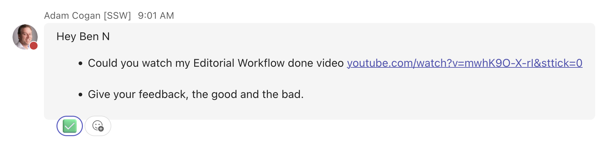

Clear, **written text** is by far the best way to communicate, so always try to write down your thoughts instead of relying on emojis reactions, which can easily be misinterpreted.

For example, in Teams chats, a 👍 (thumbs up) is often used to either **acknowledge a message** or to **indicate that a task is done**. This can lead to ambiguity for the sender, especially when the task isn’t completed immediately.

Emoji reactions can be used effectively—when they’re applied consistently and with clear meaning, they become a useful way to give quick responses and visually communicate the status or progress of a message at a glance.

<!--endintro-->

To improve clarity and keep everyone aligned:

* React with 👀 when you've seen the message and plan to action it later
* Once the task is complete, update your reaction to ✅ to signal it’s done

This simple habit reduces confusion, keeps chats clean, and ensures the whole team can track progress at a glance.

