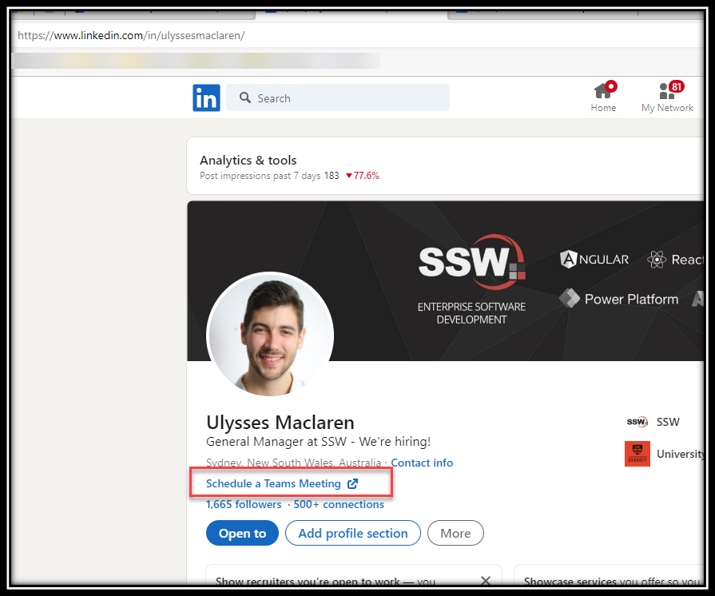
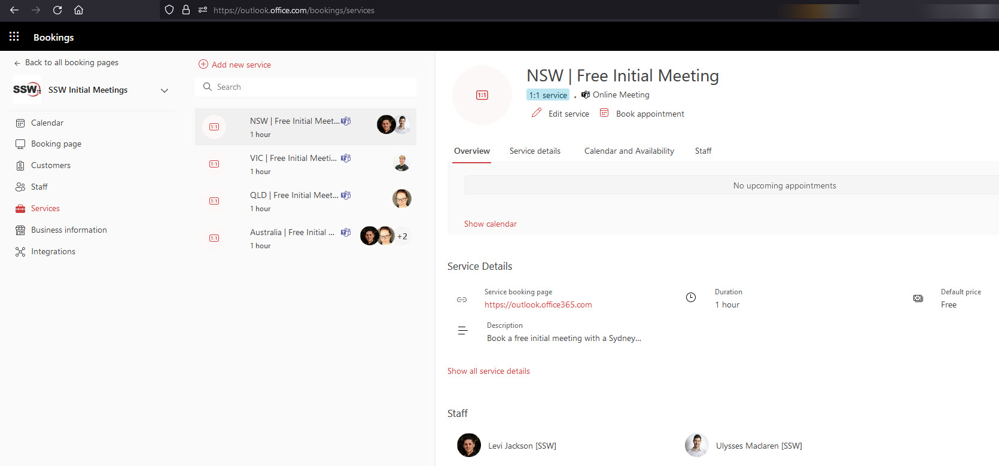
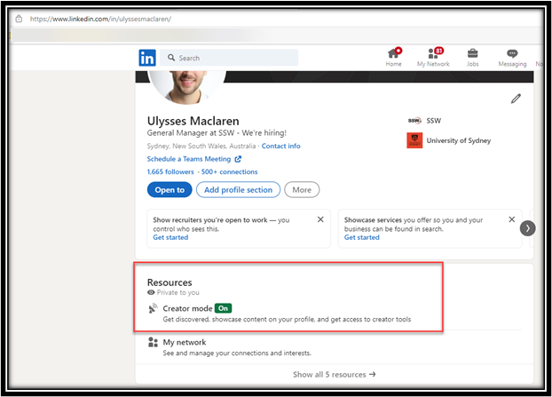

Hey there! Are you tired of the back-and-forth emails trying to find a suitable time for a meeting with external or internal parties? Well, fret no more!

That's what scheduling automation is for, there are tonnes of tools that solve the problem.

<!--endintro-->

### The tools

* [Microsoft Bookings](https://www.microsoft.com/en-au/microsoft-365/business/scheduling-and-booking-app) and [Bookings with me](https://outlook.office.com/bookwithme/me) (recommended)
* [Calendly](https://calendly.com/)

`youtube: https://www.youtube.com/embed/LsFofCLoUJE`
**Video: Microsoft Bookings - How to get started (2 min)**

::: greybox

**Scenario:** You've got the client interested, but then booking in a time can be hard work. Account Managers often have to bounce between the clients availability and their own calendars with the classic tale of...

---

**Uly**: "I've got a slot at 3pm on Friday, are you free?"

**Bob Northwind:** "No sorry, I'm on leave that day!"

**Uly:** "How about Monday 9am?"

**Bob Northwind:** "No sorry... I'm at a yoga class then!"

etc...

:::

::: bad
**Figure: Bad example - It's hard to find a common time to book a meeting if you don't have scheduling automation**
:::

::: good

:::

You can create an individual booking page ("Bookings with me") or a shared booking page, for a team ("Microsoft Bookings").

### Create a Microsoft Bookings page for a team

1. Open [Microsoft Bookings](https://www.microsoft.com/en-au/microsoft-365/business/scheduling-and-booking-app)
2. Click on "Create" | Choose if you want to create from scratch or clone an existing one
3. Choose a name for your booking page (e.g., "Initial Recruitment Meetings") and customize it with your branding and settings
4. Invite the Staff members that will be part of the calendars, and choose their roles
5. Set up a service - this is a booking type that can be selected when visiting your booking page
6. Add any required custom questions or additional information
7. Choose who can book appointments - anyone with the link, people in your organization only, or no self service
8. Save your changes and share the booking page link with external parties
9. Now, they can easily book a meeting with you by selecting a suitable time slot from the available options 📅
   

### Create a Bookings with me page for individual bookings

1. Go to [Bookings with me](https://outlook.office.com/bookwithme/me) | This will trigger the creation of your individual calendar
2. Create a new meeting type | Set the availability and duration of the meetings
3. Add any specific questions or information you need from the external parties
4. Save your changes and share the booking page link with the people you want to meet individually

* You can also retrieve this link by going to your OWA (Outlook web access) calendar and grabbing it from the left hand sidebar

6. They can now easily schedule a meeting with you by selecting a suitable time slot from your availability 🕒

Tip: If you will use this link in a lot of emails, create an [autocorrect for it in Outlook](https://www.ssw.com.au/rules/autocorrect-in-outlook)

### Adding your "Microsoft Bookings" link to your LinkedIn profile

Now that you created your booking calendar, one of the best places to use it is on Social Media, and below are instructions on how to use it on LinkedIn:

1. Turn on "Creator Mode" first - you can't have a link in your profile without it turned on

   

3. Now login to LinkedIn | Click on “Me” | “View Profile”
4. Click on the Edit profile button
5. Scroll all the way down to “Custom Action”
6. Add link and link text | Save

That's it! You're all set to let externals book meetings with you hassle-free using Microsoft Bookings! 🎉✨

Remember, it's important to keep your booking pages up to date and regularly check for new bookings. Also, make sure to follow up with any additional instructions or confirmations after a booking is made.
