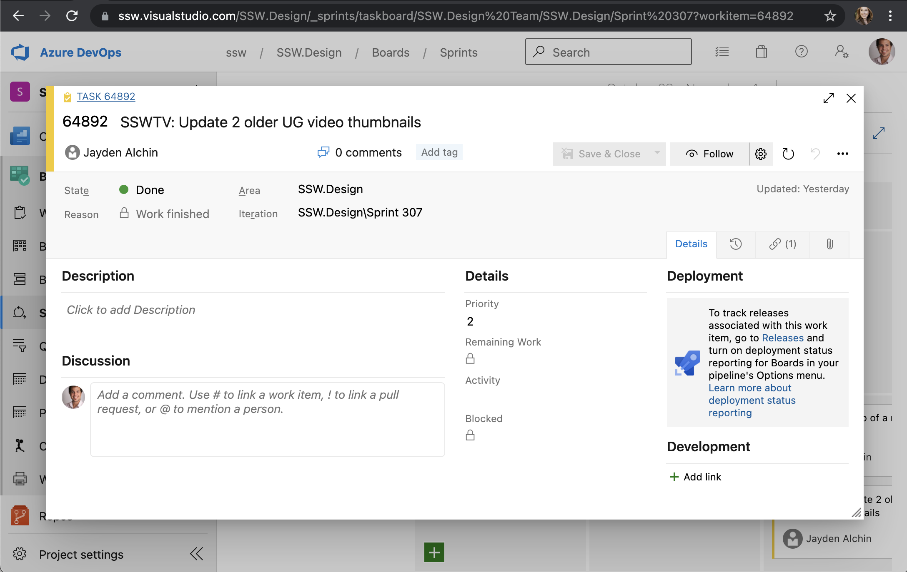

All team members must update their tasks with  status, (and remaining hours if you are estimating tasks) prior to the daily Scrum meeting.

<!--endintro-->

**Note:** If you are updating the details of a PBI then follow the rule [Do you know when you use @ mentions in a PBI?](/when-you-use-mentions-in-a-pbi)

::: greybox
In Scrum, there are 4 meetings in total that you need to know about:

* [Sprint Planning Meeting](/do-you-know-what-happens-at-a-sprint-planning-meeting "Sprint Planning Meeting")
* Scrum Meeting (Daily standup - described on this page)
* [Sprint Review Meeting](/do-you-know-what-happens-at-a-sprint-review-meeting "Sprint Review Meeting")
* [Sprint Retrospective Meeting](/do-you-know-what-happens-at-a-sprint-retrospective-meeting "Sprint Retrospective Meeting")

:::

---

### Scrum at Microsoft Videos

#### Short Version (3:48)

`youtube: https://www.youtube.com/embed/YR84qH6d7QE?rel=0`

#### Long Version (12:15)

`youtube: https://www.youtube.com/embed/-UUrLxNBK_g?rel=0`