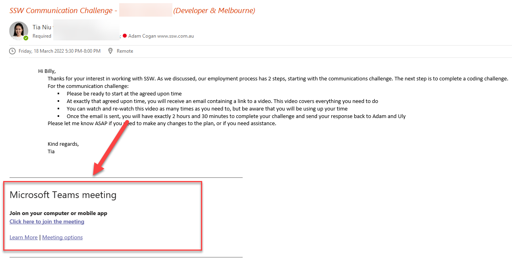

When you send a meeting appointment to someone, it’s important to put the meeting join information (e.g. Microsoft Teams Meeting URL) at the top of the email body as whoever is invited will be able to quickly find the link. 

If the meeting URL is placed under the email body, there are more chances the receiver could miss out on your meeting URL.  

<!--endintro-->

By doing this, you will make it clear it is a remote meeting held via the tool you decided to use. This gives the receiver more time to get prepared for the meeting (e.g. Download and test a software they are not familiar with).

::: bad

:::

::: good

:::