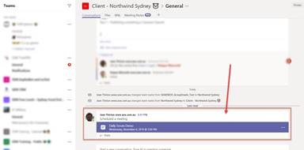

Sending appointments from Teams feels less natural than from Outlook but there are some great benefits:

* Appointment -  You don’t need to remember everyone’s name - The whole team is invited
* Appointment - In the appointment, it auto-generates a link so that everyone goes to the right place to attend
* Visibility - It shows up in Teams Calendar
* Visibility - It appears in the Teams chat (for the channel that was invited)
* Visibility – When the appointment is beginning the app pops up with a button to “Join”
* History - If you decide to record the meeting, the link to the recording shows up in the chat history as well

**Important:** Although the meeting app works great to organize Teamwork such as Scrum meetings or other client meetings, it is not very suitable for more global events such as a retreat or a conference. At SSW we use Microsoft Outlook appointments in those instances.

<dl class="badImage">&lt;dt&gt;
             
             
         &lt;/dt&gt;<dd>Figure: Bad Example - This appointment was created using Outlook using Zoom - the team members needed to be added to the appointment individually and there are too many options on how to join the meeting. </dd></dl>

<dl class="goodImage">&lt;dt&gt;
      
   &lt;/dt&gt;<dd>Figure: Good Example - I know this appointment was created in Microsoft Teams since it was created on behalf of the team (see sender) and at the bottom it has a link so that people can click and join the correct meeting (even without Teams installed) </dd></dl>
<!--endintro-->
<dl class="image"><h3 class="ssw15-rteElement-H3">How to make a Teams Meeting </h3>&lt;dt&gt; 
        
   &lt;/dt&gt;&lt;dt&gt;To setup a Teams meeting, simply navigate to "Calendar" and then either "Meet Now" or "New Meeting". &lt;/dt&gt;&lt;dt&gt; 
      
   &lt;/dt&gt;<dd>Figure: Creating a new meeting </dd></dl><dl class="image">&lt;dt&gt;
      
   &lt;/dt&gt;<dd>Figure: Meeting options</dd></dl>
You can select a Channel to meet in and by doing so, members of the Team in which this channel lives will see a Channel activity that you can click to directly jump in the meeting.
<dl class="image">&lt;dt&gt;
       &lt;/dt&gt;<dd>Figure: meeting channel activity</dd></dl>
Microsoft Teams will also send out an email invitation email for the meeting - this is especially useful when inviting people outside your organization.

### Related rule

* [Do you make your team meetings easy to find?](/_layouts/15/FIXUPREDIRECT.ASPX?WebId=3dfc0e07-e23a-4cbb-aac2-e778b71166a2&TermSetId=07da3ddf-0924-4cd2-a6d4-a4809ae20160&TermId=8b74eb19-4dad-492b-a3b1-d1ad07371551)
