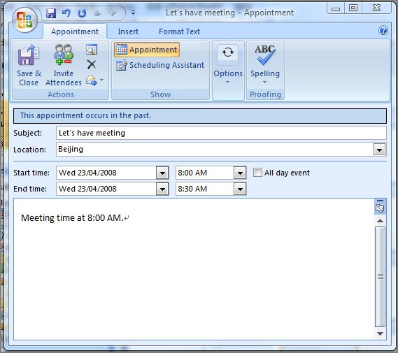
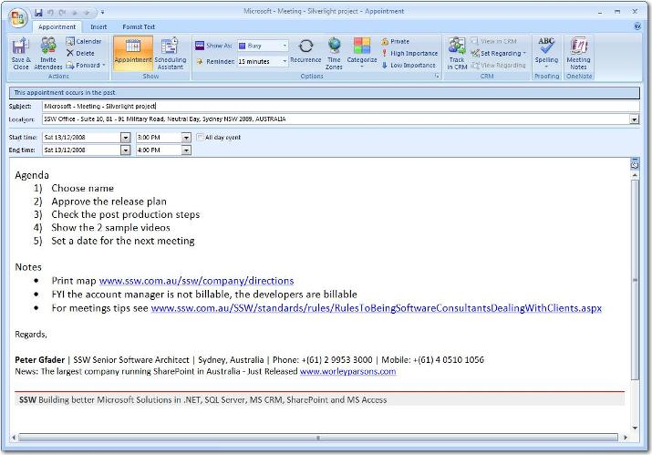

Office meetings often are ineffective, because:

* There is a lot of discussion but no resulting "action items"
* Time is wasted digressing to unrelated topics
* People forget the meeting is on and do not attend
* People turn up late with no notice

<!--endintro-->

To ensure your meetings are productive and successful, you should:

* Make Sure the AV setup is correct. Please refer to the SugarLearning item '[AV Setup for Skype for Business Meetings](https://sugarlearning.com/companies/SSW/items/13053/av-setup-for-skype-for-business-meetings)'.
* Create a meeting agenda prior to the meeting. Give each attendee a copy. If the discussion strays from the topic, the agenda will help you keep it on track.
* Send [an appointment](/meetings-do-you-know-the-way-meetings-should-work) to all meeting attendees to ensure the meeting appears on their calendar.
* If you are going to be late, contact the organizer or the person in charge of the meeting to let them know that you are running late and what time you will be arriving.
* To improve future meetings, at the end of the meeting, do a quick debrief to see how long the meeting took, if anything was covered that didn't need to be, etc.

::: bad  
  
:::

::: good
Figure: Good example - meeting with Agenda  
:::

Every Outlook appointment must have:

1. A good subject, to let attendees know the purpose of the meeting, see our rule [Do you realize the importance of a good email Subject?](/do-you-realize-the-importance-of-a-good-email-subject)
2. A good description of the location, including detailed information like location name and street
3. The message itself must contain:
    1. A link to the location with instructions to print it eg. Print this map http://www.ssw.com.au/ssw/company/directions or a google map link
    2. The final step in the agenda being "Set a date for the next meeting"
    3. A note mentioning if the meeting is billable or not
    4. Your standard footer in message (same footer as in mail messages)
    5. A URL mentioning [Tips for better meetings](http://www.ssw.com.au/ssw/Redirect/TipsForMeeting.htm)

Hi Bill Northwind
* Print map http://www.ssw.com.au/ssw/company/directions
* FYI the account manager is not billable, the developers are billable
* For meetings tips see [Rules to being Software Consultants - Dealing with Clients](/rules-to-better-software-consultants-dealing-with-clients)

          Figure - Message example
