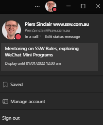
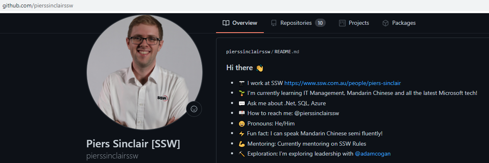

There's a few types of mentoring:

* **\#1 Consulting mentoring** where you hire expert consultants because you don't have the skills within your company. This is most commonly all day engagements e.g.[ SSW's Mentoring Services](https://www.ssw.com.au/ssw/Consulting/Mentoring.aspx). 

If you have the skills within your company, then you can up-skill people using the brains of your own company and this usually falls into two groups

* **\#2 Ad-hoc mentoring** (informal) where you get advice when you need it
* **\#3** **Scheduled mentoring** (formal), when you book in meetings and make a plan

<!--endintro-->

## Who mentors who?

Most consider mentoring to be a senior guiding and building the skills of a junior. However, you can really supercharge your company if you understand that **everyone** has something that they can teach **someone**. Being a mentor also makes people better, so employees should be encouraged to think about what they can teach others.

## What should I get mentored on?

The first decision should be whether you want soft skills or technical skills (choose one topic at a time). You may already know what you would like to be mentored in, however you really should ask your peers what they think you should be mentored on. You could have a blind spot. Here's how to approach it:

* Make a list on what you would like to be mentored on, e.g. PowerShell, Power BI, Power Apps, Power Speaking... ha ha 😉
* Approach a few people you trust, and ask them what you should be mentored on (without showing them your list
* Then show the list, and brainstorm ideas
* Make a decision, and approach a mentor

Here are some of the things you can learn:

* Public Speaking
* Account Management
* Low Code solutions e.g. Power Apps & Dynamics
* Frontend Frameworks e.g. Angular, React & Blazor
* Backend - e.g. database design, Clean Architecture
* Debugging
* Designing big solutions - Cloud Architecture
* Great blogging
* Increasing your social media presence

## Scheduled mentoring - How does it work?

As a mentee, you will be driving your progress. If you need additional motivation, add what you are learning to your Teams Status. Mentors - you can do the same, let people know what you're mentoring.

You will need to book a few appointments with your mentor:

* 5 minute chats at the end of every week to catch up to see how you're progressing 
* 3x monthly mentoring sessions (about 30mins) to work on your target areas.

It is motivating to know that you will be checking-in with your mentor regularly. At the end of your 3 months, sit down and recap how well it went for you. It's helpful to give a mark out of 10. 

### 1st Meeting

* Tell the mentor what you would like to achieve by the end of the 3 months
* Work out your goals & set targets
* Then the mentee works independently for a month, checking-in when needed
* At the end of each week, check-in for 5 mins to let them know how you're going

### 2nd Meeting

* The Mentor will review their progress and give tips or suggestions on how to move forward
* Set new goals
* Then the mentee works independently for a month
* At the end of each week, check-in for 5 mins to let them know how you're going 

### 3rd Meeting

* The Mentor will review their progress and give tips or suggestions on how to move forward
* Set some longer-term goals
* Then the mentee works independently, checking in when needed informally

### Reward both parties

You can add this new skill to your LinkedIn or Git Hub Profile and mention your mentor.

