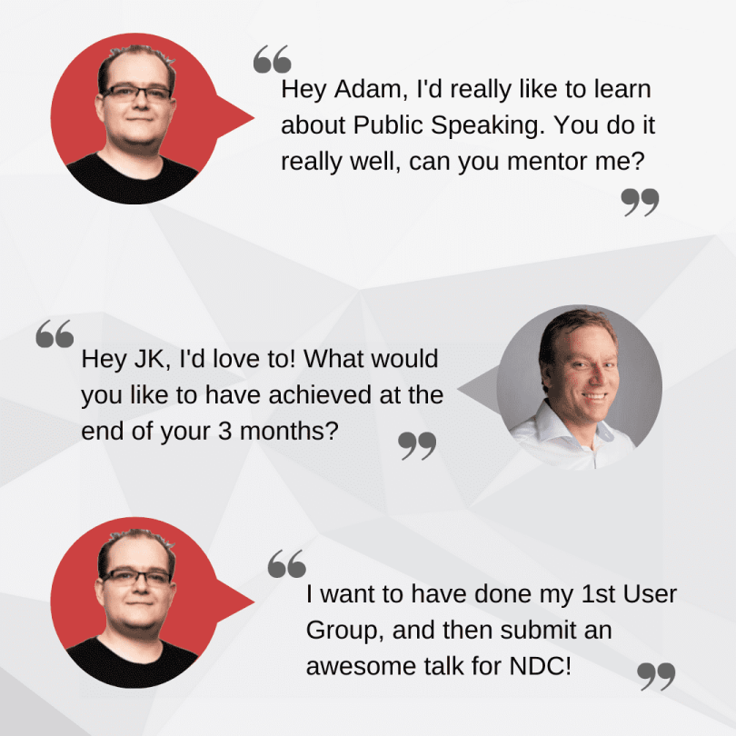
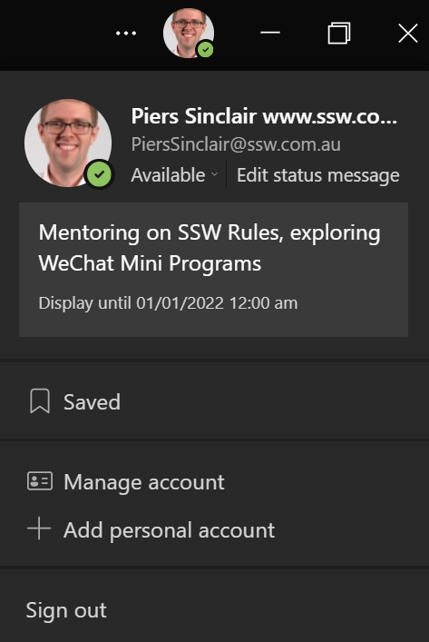
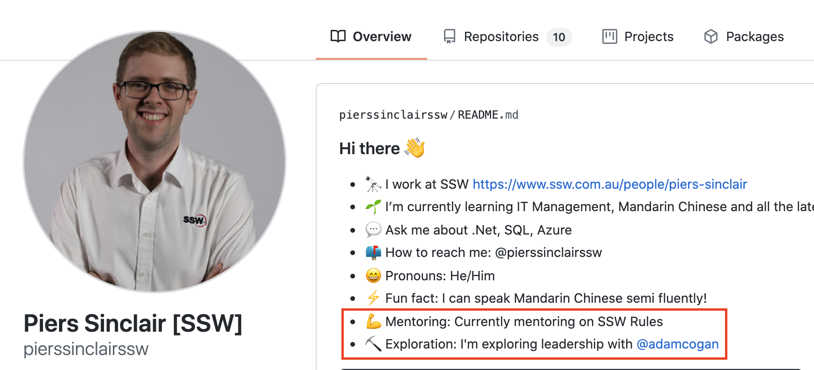

Implementing a mentoring program is a powerful strategy for fostering professional growth and knowledge transfer within an organization. By pairing individuals at different experience levels, the program accelerates learning, promotes skill development, and cultivates a collaborative environment. Ultimately, it contributes to the overall success of the team.

<!--endintro-->

`youtube: https://www.youtube.com/embed/ang3jKb3DFU`

**Video: Do you have a formal or informal mentoring program? (9 min)**

There's a few types of mentoring. When you don't have the skills within your company, you hire expert consultants:

* **Consulting mentoring -** This is most commonly all day engagements. E.g.[SSW's Mentoring Services](https://www.ssw.com.au/consulting/mentoring)

If you do have the skills within your company, then you can up-skill people using the brains of your own company and this usually falls into 2 groups:

* **Ad-hoc mentoring (informal) -** You get advice when you need it
* **Scheduled mentoring (formal) -** You book in meetings and make a plan

## Who mentors who?

Most consider mentoring to be a senior guiding and building the skills of a junior. However, you can really supercharge your company if you understand that **everyone** has something that they can teach **someone**. Being a mentor also makes people better, so employees should be encouraged to think about what they can teach others.

## What should I get mentored on?

The first decision should be whether you want soft skills or technical skills (choose one topic at a time). You may already know what you would like to be mentored in, however you really should ask your peers what they think you should be mentored on. You could have a blind spot. Here's how to approach it:

* Make a list on what you would like to be mentored on. E.g. PowerShell, Power BI, Power Apps, Power Speaking...
* Approach a few people you trust, and ask them what you should be mentored on (without showing them your list)
* Then show the list, and brainstorm ideas
* Make a decision, and approach a mentor

Here are some of the things you can learn:

* Public Speaking
* Account Management
* Low Code solutions e.g. Power Apps & Dynamics
* Frontend Frameworks e.g. Angular, React & Blazor
* Backend - e.g. database design, Clean Architecture
* Debugging
* Designing big solutions - Cloud Architecture
* UI/UX Design
* Great blogging
* Increasing your social media presence

## Scheduled mentoring - How does it work?

The first step is for mentees to find mentors or vice-versa.

Once a pairing has been established, the mentor is responsible for scheduling a few meetings with the mentee.

1. Initial Meeting (30 mins): Introduction to the program and determination of the mentee's specific learning targets
2. Weekly Check-ins (5 mins): A quick chat at the week's end to gauge the mentee's progress
3. Monthly Sessions (for 3 months, 30 mins each): Intense mentoring sessions to tackle mentee's chosen target areas
4. Final Meeting (30 mins): Wrap up, retrospection, and gathering of feedback to refine the program further

As a mentee, add what you are learning to your Teams status. Mentors can do the same, and let people know what you're mentoring.

### Initial Meeting

* Tell the mentor what you would like to achieve by the end of the 3 months
* Work out your goals & set targets
* Then the mentee works independently for a month, checking-in when needed
* At the end of each week, check-in for 5 mins to let them know how you're going

### 3 Monthly Meetings

* The Mentor will review their progress and give tips or suggestions on how to move forward
* Set new goals
* Then the mentee works independently for a month
* At the end of each week, check-in for 5 mins to let them know how you're going

### Final Meeting

* The Mentor will review their progress and give tips or suggestions on how to move forward
* Set some longer-term goals
* Then the mentee works independently, checking in when needed informally

It is motivating to know that you will be checking-in with your mentor regularly. At the end of your 3 months, sit down and recap how well it went for you. It's helpful to give a mark out of 10.

### Reward both parties

It's nice to be thankful, so add this new skill to your GitHub profile, make a social media post or even add it to your LinkedIn. Remember to give your mentor an @mention.

