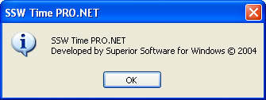
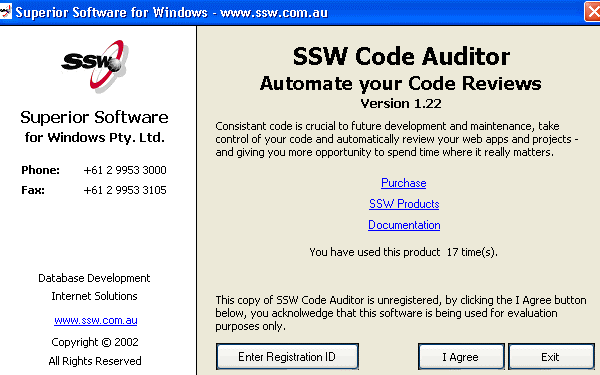
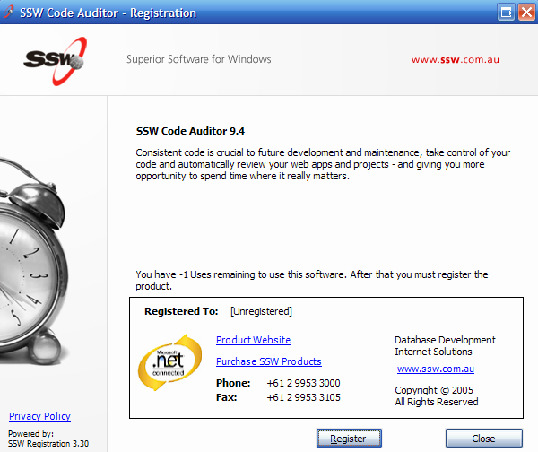

Every application you build should have the same "Help | About" form. The form should always display the following information:

<ol><li>Version number</li>
<li>URL</li>
<li>Description of the product and what it does. Tip: This should be consistent with your standard description on the product box, website homepage, product page etc. </li>
<li>Contact details (especially a phone number)</li>
<li>Branding (logo)</li></ol>
 <excerpt class='endintro'></excerpt> 
​<dl class="badImage"><dt></dt>
<dd>Figure: Bad Example - This "About" dialog does not provide enough information about the product and/or company</dd></dl>
<dl class="image"><dt></dt>
<dd>Figure: This "Help | About" form contains all 5 elements, but has room for aesthetic improvements (old SSW design)</dd></dl>
<dl class="goodImage"><dt></dt>
<dd>Figure: Good Example - This "Help | About" has the 5 elements presented better,</dd></dl>

