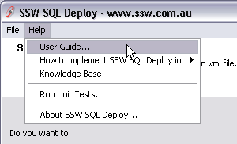

Users who are finding your application a little hard to use will always look for a user guide. The first thing they would do is to reach for the help menu. The "About" button can provide a link to the product website, but this is not very handy and obvious for a user who needs quick help. A link to the user guide must be in the "Help" menu.

 <excerpt class='endintro'></excerpt> 
​
There are benefits of having your user guide online:

<ol><li>Easier to keep up-to-date and maintain</li>
<li>Stats on usage</li>
<li>Allows community commenting</li></ol>
<dl class="goodImage"><dt></dt>
<dd>Figure: Good Example - "User Guide" link in the "Help" menu</dd></dl>
<dl class="goodImage"><dt></dt>
<dd>Figure: Good Example - Telerik keeps their "User Guide" online</dd></dl>

