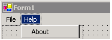

A good help menu should have these 8 items in it:

1. Training Videos
2. Online User Guide
3. Knowledge Base
4. Make a Suggestion
5. Report a Bug
6. Check for Updates - [Product Name]
    * Check for Updates - All Programs
7. Run Unit Tests...
8. About [Product Name]...

<!--endintro-->
<dl class="badImage">&lt;dt&gt;&lt;/dt&gt;
<dd>Figure: Bad Example - Example of a Help menu with only "About"</dd></dl><dl class="goodImage">&lt;dt&gt;&lt;/dt&gt;
<dd>Figure: Good Example - Example of a Help menu with all 8 items</dd></dl>
