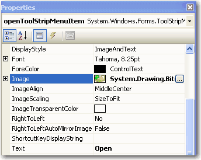

Plain menu items make your application look normal and less expressive. 
<!--endintro-->
<dl class="badImage">&lt;dt&gt;&lt;/dt&gt;
<dd>Figure: Bad Example - Plain menu</dd></dl>
While icons can make your application look good.
<dl class="goodImage">&lt;dt&gt;&lt;/dt&gt;
<dd>Figure: Good Example - Menu with icons</dd></dl>
# More information

You can use the MenuStrip control in .Net
<dl class="image">&lt;dt&gt;&lt;/dt&gt;
<dd>Figure: the Menuitem has a simple image property</dd></dl>
