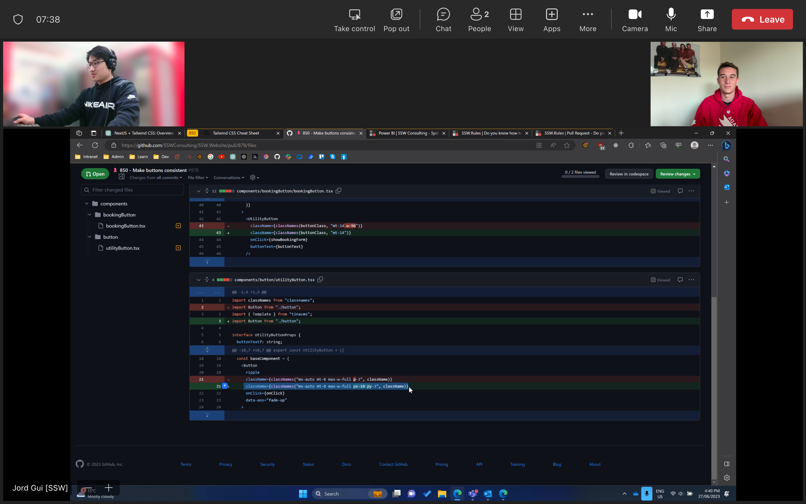

If you are in a team (i.e. an internal contributor), it is the PR author's responsibility to get a PR reviewed and action feedback ASAP.  
As an internal contributor it's a good idea to have a [call with the PR reviewers](/over-the-shoulder).

If you are **not** part of the team (i.e. an outside contributor), reviewing the PR is the responsibility of the repo maintainers. Actioning the feedback is still the responsibility of the PR author. 
As an outside contributor, it's a good idea to chase the reviewers by reaching out with a comment on GitHub, or through the repo's community (e.g. Discord channels).

When a PR is created but left open for a long time, it becomes stale. Stale PRs equate to merge debt because the longer the PR stays open, the more changes occur on the main branch and the harder it is to merge back in.

Merge debt refers to the amount of work a PR has to undergo before it can be merged into the main branch. If the PR is brand new, the amount of work required to merge is near to none, but as the PR stays open, the more work gets done on the main branch, leading to more work needing to be done to ensure the PR is up-to-date and able to be merged.

<!--endintro-->

Merge debt can be avoided by:

* Ensuring PRs don't stay open for too long
* Conducting daily reviews on repos to ensure all PRs that can be merged are merged
* Ensuring that once a PR is ready to be merged, an "over-the-shoulder" review occurs.

::: bad

:::

::: good

:::
