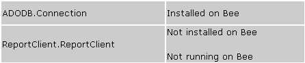
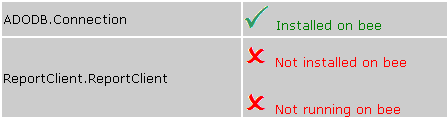
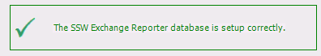
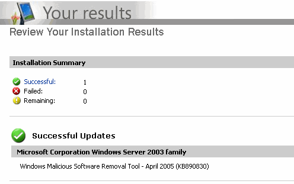

When a user looks at a test result, they want to be quickly informed. Therefore, you must make it clear weather the test has passed or failed, or is there any warning.

 <excerpt class='endintro'></excerpt> 
​<ul><li>For a pass, the message should be green in color, and a tick next to the message. </li>
<li>For a fail, the message should be red in color, and a cross next to the message. </li>
<li>For a warning, the message should be yellow/orange in color, and an exclamation mark next to the message. </li></ul>
<dl class="badImage"><dt></dt>
<dd>Figure: Bad Example - Pass and fail are not clear</dd></dl>
<dl class="image"><dt></dt>
<dd>Figure: Green text and tick for pass, red text and cross for fail (Better)</dd></dl>
<dl class="goodImage"><dt></dt>
<dd>Figure: Good Example - Status on windows forms</dd></dl>
<dl class="goodImage"><dt></dt>
<dd>Figure: Good Example - Microsoft Update uses 3 icons to indicate different status, and good quality of Images too</dd></dl>

