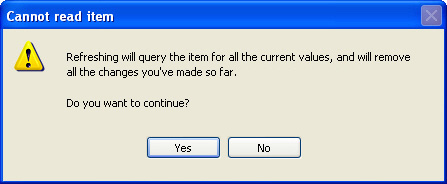
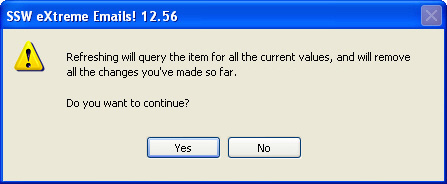

Message boxes should have consistent and informative titles and descriptions, and icons should be used appropriately.

<!--endintro-->

#### Title

The title should contain the application name, so the user knows what application generated the warning/error. This is especially important when developing add-ins (e.g. Outlook add-ins or Smart Tags) as it can be difficult to know what caused the message box to pop up.  **Application.ProductName** and  **Application.ProductVersion** should be used to retrieve the data from AssemblyInfo. There is no need for the title to contain a brief description of the error because that information is readily available in the message box itself.
<dl class="badImage">&lt;dt&gt;&lt;/dt&gt;
<dd>Figure: Bad Example - Title contains brief description of error, which is already contained in the message box</dd></dl><dl class="goodImage">&lt;dt&gt;&lt;/dt&gt;
<dd>Figure: Good Example - Title contains Product Name ("SSW eXtreme Emails!") and Product Version ("12.56")</dd></dl>
We have a program called [SSW Code Auditor](http://www.ssw.com.au/ssw/CodeAuditor/Rules.aspx#TitleCS) to check for this rule.

 **Note** : The Version Number in the title should only contain the Major and the Minor version numbers (e.g. 11.28) and not the complete Major.Minor.Revision.Build Numbers (e.g. 11.28.92.1198)
