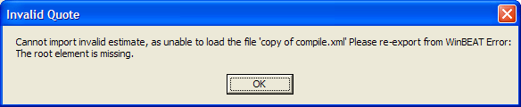
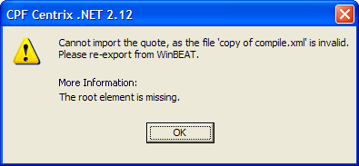

<h4>Description</h4>

The description should explain <em>what the error was</em>, followed by the <em>why it occurred</em>. Information that is useful for debugging should be included with errors where possible in a "Details" section. You should also avoid making the text unnecessarily wide. e.g.

 <excerpt class='endintro'></excerpt> 
​<dl class="badImage"><dt></dt>
<dd>Figure: Bad Example - A message box that does not intuitively alert the user</dd></dl>
<ul><li>This is confusing, because it uses different terminology to the title ("estimate" instead of "quote")</li>
<li>There is no punctuation</li>
<li>The word "Error" is meaningless</li>
<li>Line breaks are not present, so the message box is too wide and the text may wrap in the wrong spot</li></ul>
<dl class="goodImage"><dt></dt>
<dd>Figure: Good Example - A message box that is clear, consistent and intuitive</dd></dl>
<ul><li>Terminology is consistent</li>
<li>Punctuation is present</li>
<li>"Details" indicates that this information is useful for debugging</li>
<li>The text is split across three lines, and the technical information after Details is separated from the description of the error</li></ul>

