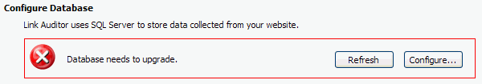

It is very important to use a clear information icon to show the current status. The icon should be consistent with the actual status.

 <excerpt class='endintro'></excerpt> 
​<dl class="badImage"><dt></dt>
<dd>Figure: Bad Example - The icon is not consistent with the actual status</dd></dl>
<dl class="goodImage"><dt></dt>
<dd>Figure: Good Example - Use spinning icon to show the checking status</dd></dl>
<dl class="goodImage"><dt></dt>
<dd>Figure: Good Example - Use red cross icon to show the wrong status</dd></dl>
<dl class="goodImage"><dt></dt>
<dd>Figure: Good Example - Use green tick icon to show the correct status</dd></dl>

We have another similar rule for Web application - <a href="http://www.ssw.com.au/ssw/standards/rules/RulesToBetterWebsitesLayout.aspx#StatusIcon">Do you use icons in web pages to indicate status directly?</a>

You can get <a href="http://www.ssw.com.au/ssw/standards/images/OurTicksCrosses/browse.aspx">SSW's ticks and crosses here.</a>

