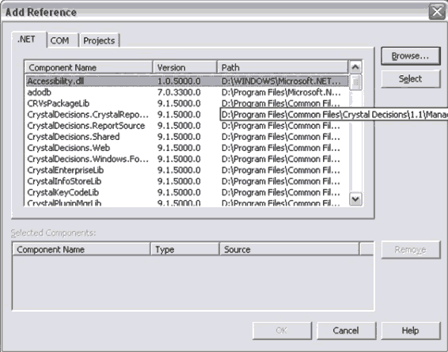

The following method of adding file references to a large solution was also attempted.

<!--endintro-->

This method involves projects referencing assemblies by looking into their reference path.

**Advantages**
The main advantage of referencing .dll's is that it is more flexible. Projects can reference assemblies from other solutions outside the current solution.

 - The solution's environment is "cleaner", allowing projects to be more expansive.
 - All you need to do is change the assembly to "shared".

**Disadvantages**
There are, however, many disadvantages including the fact that only one version of the proj file can be added to the solution.

- The .csproj file cannot be used.
- You cannot reference or one set of assemblies for debug and another for release. Only point to one.
- VS.NET only use the paths specified in the .proj file as a hint. VS.NET records the location of the assemblies as options for the project for each user.
- You cannot switch between versions.
- You also cannot use this method if there are 200 projects in one solution.
