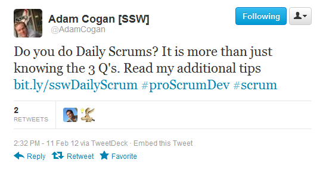

​​Tight project teams have a Daily 'Scrum' every day at the same time. 

It was once called a 'stand-up meeting' but that discriminates people in wheelchairs. 

It is best to have it standing up, so it's short and to the point. No-one wants to stand around waffling. 

 <excerpt class='endintro'></excerpt> 

Everybody knows the 3 essential questions:
<ol><li> 
      <strong>What did you do yesterday?</strong> (and did you update TFS/other bug tracking system)?</li><li> 
      <strong>What are you going to do today?</strong> (and my current task on the <a href=/the-war-room-does-your-development-room-have-an-electronic-task-board-physical-is-ok-too-for-small-co-located-teams>physical task board</a> has my picture on it)</li><li> 
      <strong>Do you have any roadblocks?</strong> (aka issues/impediments)</li></ol>
Asking these questions of every team member means no-one can hide and everyone remains connected. Further, you can notice what was promised and what was performed. This enables the team to discovers issues quickly and keep abreast of the progress.

The team's successes and failures are shared, and anyone who knows the answer to someone else's problem can help with a solution, *after* the meeting.
<dl class="image"><dt>
      <iframe width="560" height="315" src="https://www.youtube.com/embed/YR84qH6d7QE" frameborder="0"></iframe></dt><dd>Figure: Watch a Daily Scrum at Microsoft (short)</dd></dl><dl class="image"><dt>
      <iframe width="560" height="315" src="https://www.youtube.com/embed/-UUrLxNBK_g" frameborder="0"></iframe> </dt><dd>Figure: Watch a Daily Scrum at Microsoft (long) </dd></dl>

"Great video guys. Remember, it is ok to change Scrum, actually, it is necessary for success. Just adhere to the values of Scrum. "

Stephen Forte (Board member ScrumAlliance.com)

<h3 class="ssw15-rteElement-H3">Follow these essential tips to improve your Daily Scrum meetings: </h3>
 
   <strong>Tip 1: Be prepared for the meeting </strong>

 
   <strong></strong>Before you join the Daily Scrum, 
   <a href=/how-to-see-what-is-going-on-in-your-project>check the Teams group </a> to see what your colleagues have been discussing and working on, and check the portal to confirm the meeting time. If you’re joining a new project or re-joining a previous one after some time away, these steps are important to keep yourself up-to-date and abreast of progress.  

Then you’ll be able to say to your Scrum Master, “I’ve had a look at the Teams group. I am ready to join the daily Scrum.” 

 
   <strong>Tip 2: Have your Scrum Master review the Sprint Progress at the end</strong> 

At the end of the Scrum, the Scrum Master should 
   <a href=/reports-do-you-schedule-the-burndown-and-stories-overview-reports-to-be-emailed-to-the-team-every-day>review the current burn down</a> to check on the progress of the team.
<dl class="image"><dt>
      
   </dt><dd>Figure: The burndown chart in tfs.visualstudio.com </dd></dl>

   <b>Tip 3: Keep a schedule of the Daily Scrum times on a wall (+ have a recurring appointment in Outlook)​​​</b> 
<dl class="image"><dt>

Subject: 🙋Daily Scrum – 
            <b>[Project Name] </b> Hi<b> [Team name]</b>, As per our conversation, the Daily Scrum will be held each day.  Project:<b> [Project Name] </b>Scrum Master: 
            <b>[Scrum Master Name] </b> Regards,  <b>[Your name here]</b>

&lt;This email was sent as per 
            <a href="/Management/RulesToSuccessfulProjects/Pages/DailyStandUpScrum.aspx">Do you do Daily Scrums? </a>&gt;   

</dt><dd>Figure: Schedule a recurring Daily Scrum meeting in Outlook using this template </dd></dl><dl class="image"><dt>
      
   </dt><dd>Figure: Or you can use Microsoft Teams</dd></dl>

   <strong>Tip 4: Keep to the schedule. Same place, same time (and start even if people are missing)</strong>

Get started on time. Especially in the beginning, people will be late, but the meeting should be held with the remaining people. Don't worry. People learn.

If the Scrum Master is not a full-time member of the team (often they are), they should attend every now and then to check the Scrum process is being followed and the Daily Scrums are being used synchronize the team and not a general meeting.

Note #1: The Product Owner (often the client) is not required at the stand-up meeting. If he wants to turn up, remind him that he has tape stuck over his mouth, so he does not talk. 

Note #2: If you are not doing an approved sprint and doing ad-hoc work, then best if the Product Owner (aka client) attends (<a href=/do-you-know-the-difference-between-ad-hoc-work-and-managed-work>see Ad Hoc work</a>).

   <strong>Tip 5: Do you update tasks before the Daily Scrum?</strong>

Daily Scrums are more effective when team members arrive when their tasks are already updated. See <a href=/meeting-do-you-update-your-tasks-before-the-daily-scrum>Do you update your tasks before the daily stand-up meeting?</a> 

   <strong>Tip 6: Don't go into detail</strong>

Keep your answers short and concise. Do not stray from the 3 main questions. Remember to use the "Parking Lot" to record topics to discuss after the Daily Scrum.

   <strong>Tip 7: No phones + no checking email. No distractions.</strong>

Technology in the Daily Scrum causes people to lose focus on the goal. The goal is for the team to synchronize by sharing what they are doing. Avoid giving people the opportunity to be distracted easily by forbidding email, SMS and mobile phones from the Daily Scrum.

   <strong>Tip 8: Use a task board (even better use an electronic one)</strong>

A task board allows people to visualize what the team is talking about.
<dl class="image"><dt>
      
   </dt><dd>Figure: The Task Board from tfs.visualstudio.com (TFS 2012)</dd></dl>

   <strong>Tip 9: Carry a pen and paper</strong>

Use a pen and paper to jot things down. A whiteboard is also great for "Parking Lot" topics that arise, to be discussed after the meeting.

   <strong>Tip 10: Don't let your Daily Scrum become a general meeting - use a "Parking Lot".</strong>

A "Parking Lot" is the place for any discussions that stop the Team from answering the 3 main questions. Only interested people stay for the "Parking Lot" to discuss issues after the Daily Scrum.

   <strong>Tip 11: If you have raised impediments, consider contacting the Product Owner </strong>
<dl class="image"><dt>
      
   </dt><dd>Figure: Often the Product Owner won’t be at the Scrum. However, call the Product Owner if you have an Impediment (aka Roadblock). Communication with the Product Owner is essential and if you haven't touched base with him in the few days, then do so. A disconnected or absent Product Owner is a sign of dysfunction.</dd></dl>

   <strong>Tip 12: What to do when you're working for a PO directly</strong>

If you don't have a team, and you're doing ad hoc work for a PO directly, it's best to contact him for the Daily Scrum every day if possible, and follow up with an email. This will keep the 2 of you synchronized.

   <strong>Tip 13: How do you enter scrum meetings into your timesheets?</strong>

Once you have completed your stand up, add “S” to your timesheet as per 
   <a href="http://www.ssw.com.au/ssw/Standards/Rules/RulesToBetterTimesheets.aspx"> Rules to Better Timesheets</a>.

   <strong>Tip 14: Use Teams or Skype </strong>

Use Teams or Skype to bridge gaps in geography.  

Focus on the Flow

"Extend this rule to focus on 'flow of value', not just people. In a continuous flow mindset, the daily standup is less about the people..... it's about flow. The team faces the scrum board and goes ticket by ticket for all the items in the 'work in progress', finding out what is needed to get it to the next stage.. respecting work in progress constraints."

      <a href="http://joelfromcanada.com/">Joel Semeniuk </a>

When using email or IM try to be as specific as possible. 

Hi Adam, 
        I have XX days until my next client booking. I have 22 emails in my inbox. Yesterday I was on sick leave.

 
       Today I am working on:
<ul><li>Timepro PBIs</li><li>Tidy inbox </li></ul>
&lt;This email was sent as per <a href="http://sugarlearning.com/Item/8291">http://sugarlearning.com/Item/8291</a>&gt;

<dd class="ssw15-rteElement-FigureBad">Figure: Bad example - Lack of details. Eg. Yesterday - if it's Monday, you wouldn't say “Yesterday was Sunday"... so if you were sick, it's more useful to go back to the prior day you were working</dd>

Adam, 
        I have XX days until my next client booking. I have 22 emails in my inbox. Last Friday I was on sick leave.

 
       Today I am working on: 
<ul><li>TimePro - Adding new button to the next day </li><li> 
         Getting my emails on "SSW.com" to zero </li></ul>
&lt;This email was sent as per <a href="http://sugarlearning.com/Item/8291">http://sugarlearning.com/Item/8291</a>&gt; 

<dd class="ssw15-rteElement-FigureGood"> Figure: Good example - Clear details  </dd><h3 class="ssw15-rteElement-H3">More information </h3>
 
   <strong>What happens when you run out of tasks?</strong>

The goal is to be productive for 8 hours of the day, so communicate with the rest of the developers and work with them on any other outstanding tasks. If there are no more tasks then take the next task from the top of the Sprint Backlog.

 
   <strong>What happens if there is a major incident?</strong>

It is important that any major incidents are dealt with first. Start with any major incidents that occurred in the last 24 hours.
<dl class="image"><dt>
      
   </dt><dd>Figure: Daily Scrums will alert everyone if there is a major problem and get all brains aligned in the right direction. There is no sense in putting a Band-Aid on a patient's scraped knee if there is a big knife in his eye!</dd></dl><dl class="image"><dt>
      
   </dt><dd>Figure: If you like this, 
      <a href="https://twitter.com/AdamCogan/status/168175594209681408">retweet</a>  ;)​</dd></dl><h3>Related rule</h3><ul><li><a href=/use-the-status-message-in-teams>Do you use the status message in Teams?</a>​ </li></ul>

