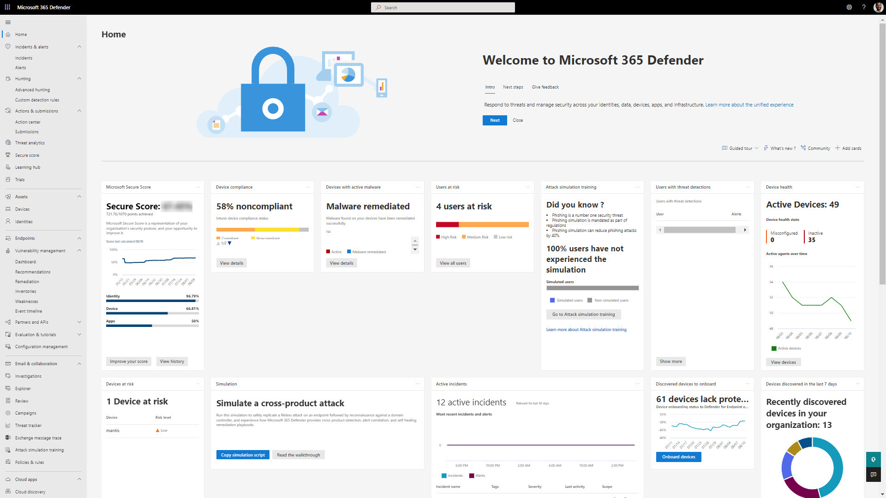
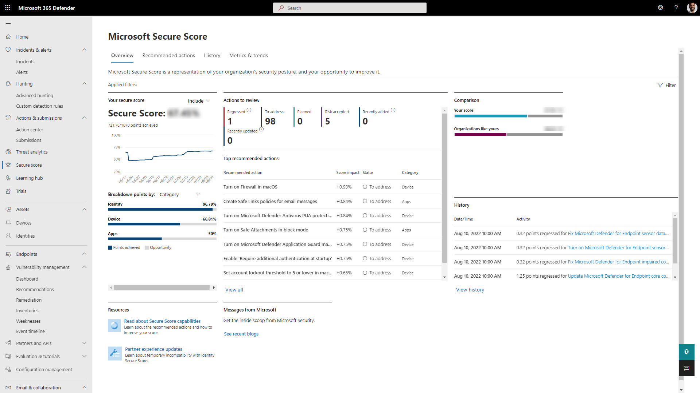
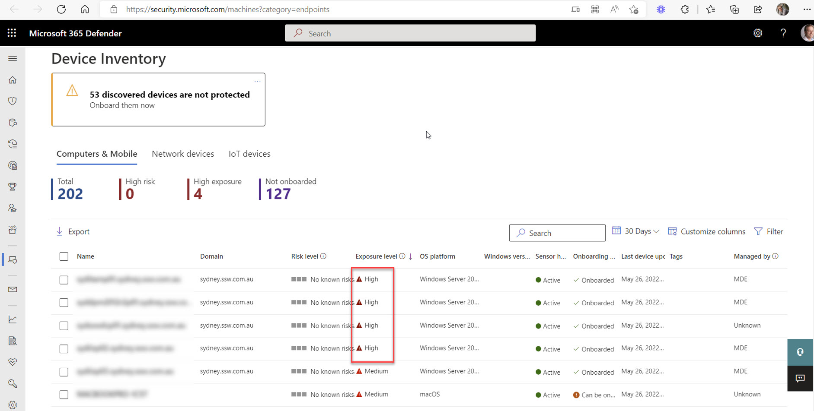
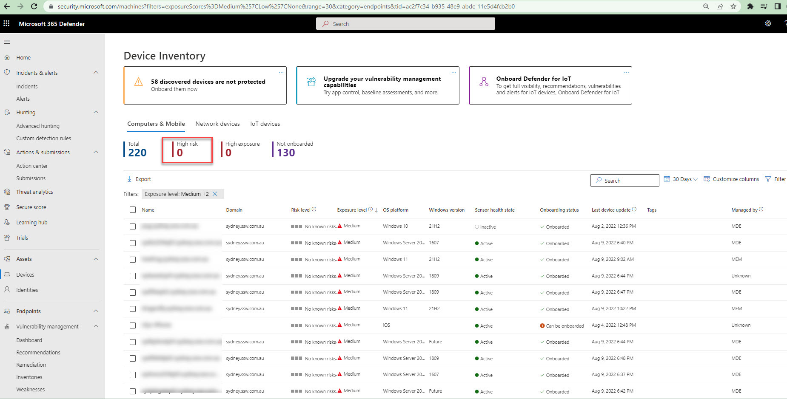
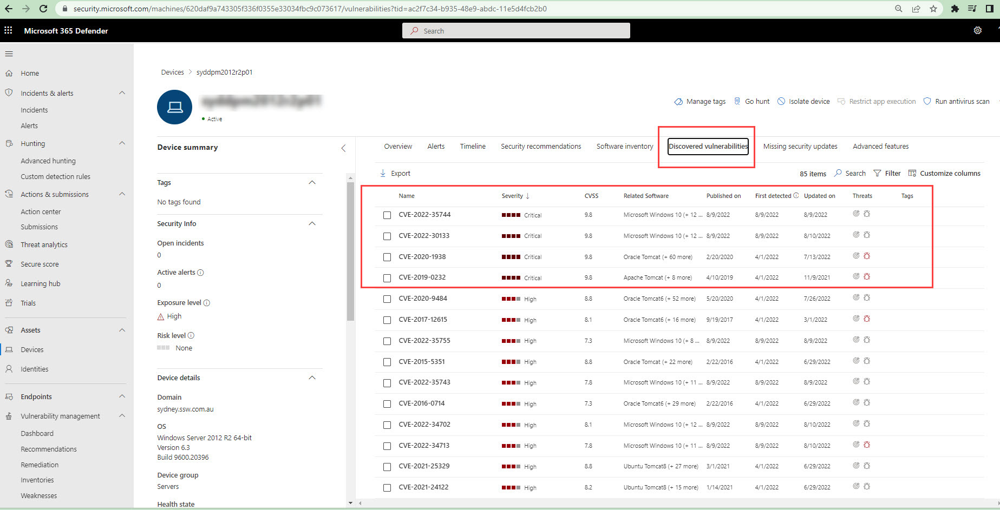
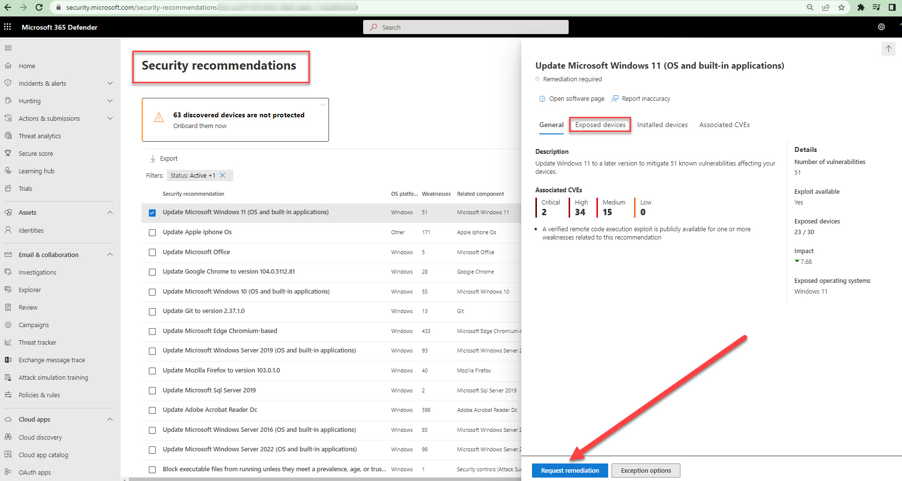

In Microsoft Defender 365 <https://security.microsoft.com/>, you can manage incidents and alerts across all your endpoints, Emails and identities. It is the place to monitor all our servers and devices connected to our organization, via Intune (MEM aka Microsoft Endpoint Management) and MDE (Microsoft Defender for Endpoint) directly via group policy 

### Secure Score: 

Microsoft Secure Score is a measurement of an organization's security posture, with a higher number indicating more improvement actions taken. It can be found at <https://security.microsoft.com/securescore>

<!--StartFragment-->

Points are given as per the following actions: 

* Configuring recommended security features 
* Remediating vulnerabilities  
* Addressing the improvement action with a third-party application or software, or an alternate mitigation

<!--EndFragment-->

### How to increase Secure Score: 

Each improvement activity is worth no more than ten points, and most of them are assessed in a binary manner. Points are received if we carry out the improvement activity, such as setting up a new policy or turning on a certain setting, or updating recommended software. Points are awarded as a proportion of the overall configuration for additional enhancement actions. 

There are many Recommendation actions suggested by Microsoft with Ranks. Score impact, Points achieved, and status  

<!--StartFragment-->

## Device Inventory 

<!--EndFragment-->

<!--StartFragment-->

The Device inventory shows a list of the devices in your network where alerts were generated. Devices are gradually added to the device inventory throughout the Microsoft Defender for the Endpoint onboarding process. Briefly, you'll see information such as device name, domain, risk level, exposure level, OS platform, onboarding status, sensor health state, and other details for easy identification of devices most at risk. 

The exposure score is continuously calculated on each device in the organization and influenced by the following factors: 

* Weaknesses, such as vulnerabilities discovered on the device  
* External and internal threats such as public exploit code and security alerts  
* Likelihood of the device getting breached given its current security posture  
* Value of the device to the organization given its role and content 

<!--EndFragment-->

<!--StartFragment-->

For all the high exposure level devices, address the discovered vulnerabilities starting with Critical severity recommendations. Once remediated, we can get those devices or servers from High exposure to Low exposure.

<!--EndFragment-->

### Security Recommendations

The Microsoft Defender portal has security recommendations for exposed devices which can be remediated manually after doing the needful (maybe a simple update).

When you request remediation, you will need to add notes, which should show the remediation activity details.