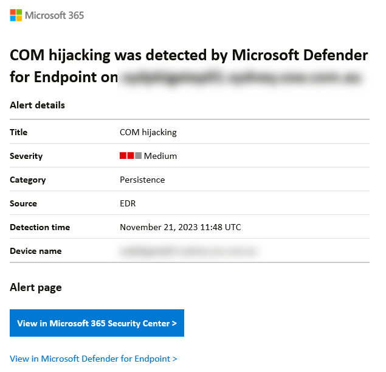
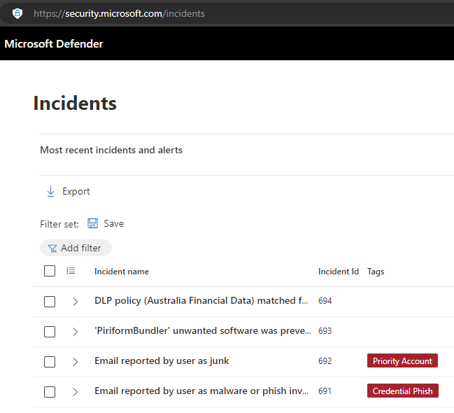
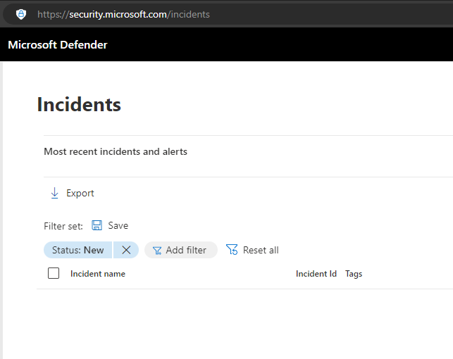

Microsoft Defender XDR (formerly Microsoft Defender 365) is a unified pre- and post-breach enterprise defense suite that natively coordinates detection, prevention, investigation, and response across endpoints, identities, email, and applications to provide integrated protection against sophisticated attacks. It is managed at https://security.microsoft.com/

<!--endintro-->

Microsoft Defender XDR helps security teams protect and detect their organizations by using information from other Microsoft security products, including:

* Microsoft Defender for Endpoint
* Microsoft Defender for Identity
* Microsoft Defender for Cloud Apps
* Microsoft Entra ID Protection
* Microsoft Data Loss Prevention
* And more

There are a number of licensing options - check out [Microsoft's documentation](https://learn.microsoft.com/en-us/defender-xdr/prerequisites#licensing-requirements) for information.

### Secure Score: 

Microsoft Secure Score is a measurement of an organization's security posture, with a higher number indicating a more secure organization. It can be found at <https://security.microsoft.com/securescore>

### How to increase Secure Score: 

Each improvement activity is worth up to 10 points, based on their importance. Points are obtained by implementing security recommendations, such as updating software or configuring Intune policies (or GPOs) to secure user accounts and devices.

Security admins should check this score regularly and improve the score where possible.

## Device Inventory (Defender for Endpoint)

Device inventory shows a list of the devices in your network. Devices are added to the device inventory through the Microsoft Defender for the Endpoint onboarding process. You'll see information such as device name, domain, risk level, exposure level, OS platform, onboarding status, sensor health state, and other details for easy identification of devices most at risk. 

**Risk level** reflects the overall risk assessment of the device based on combination of factors, including the types and severity of active alerts on the device. Resolving active alerts, approving remediation activities, and suppressing subsequent alerts can lower the risk level.

**Exposure level** reflects the current exposure of this device based on the cumulative impact of its pending security recommendations.

To onboard devices with a GPO, [follow the instructions here.](https://learn.microsoft.com/en-us/microsoft-365/security/defender-endpoint/configure-endpoints-gp?view=o365-worldwide)

To onboard devices through Intune, [follow the instructions here.](https://learn.microsoft.com/en-us/mem/intune/protect/advanced-threat-protection-configure#enable-microsoft-defender-for-endpoint-in-intune)

Security admins should check this page regularly and reduce the risk/exposure/criticality levels where possible.

### Security Recommendations

The Microsoft Defender portal has security recommendations for exposed devices which can be remediated manually after doing the needful (maybe a simple update): https://security.microsoft.com/security-recommendations/

### Incidents & Alerts

An incident in Microsoft Defender is a collection of correlated alerts and associated data that define the complete story of an attack. Defender for Office 365 alerts, automated investigation and response (AIR), and the outcome of the investigations are natively integrated and correlated on the Incidents page in Microsoft Defender.

When critical incidents occur, you should receive an email notification so that you can act on the alert immediately.

However, it is also important to check the [Incidents page](https://security.microsoft.com/incidents) in Defender, to resolve less critical alerts - or email alerts that you may have missed. It is a good idea to set a reminder to check this page weekly.

These alerts can include emails that have been reported as malware or phishing, data loss prevention (DLP), or unwanted software detections.

::: bad

:::

::: good

:::
