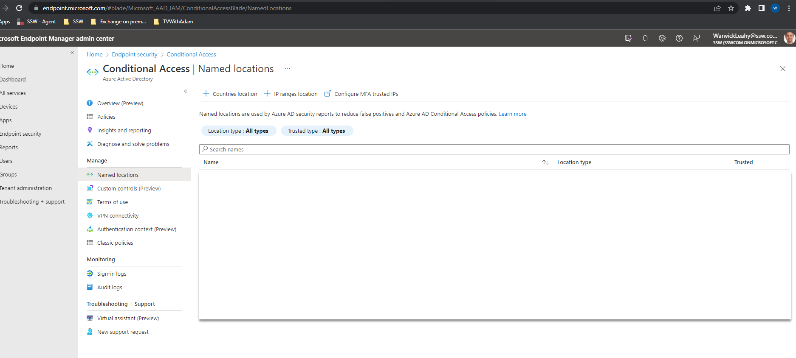
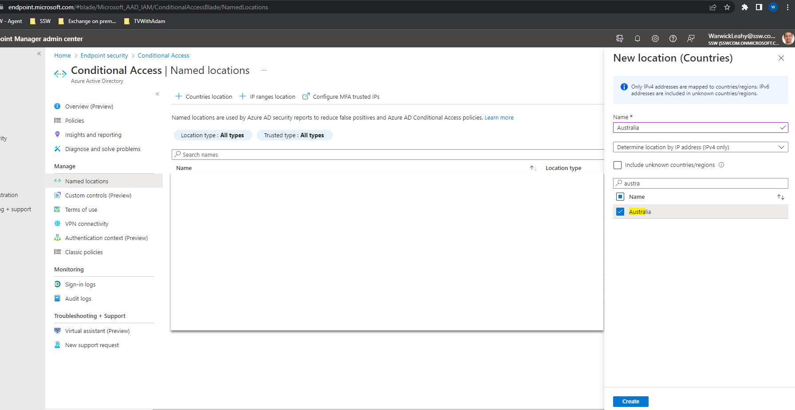
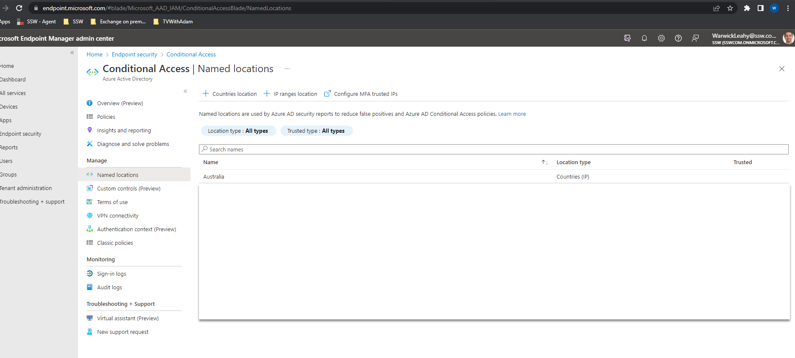
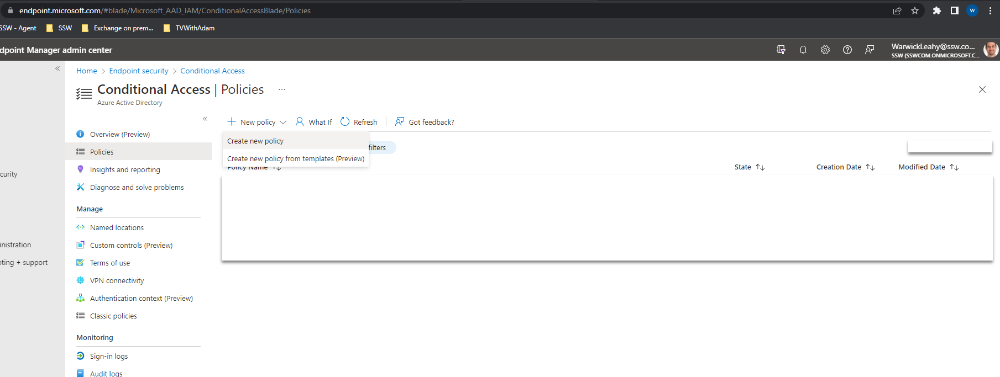
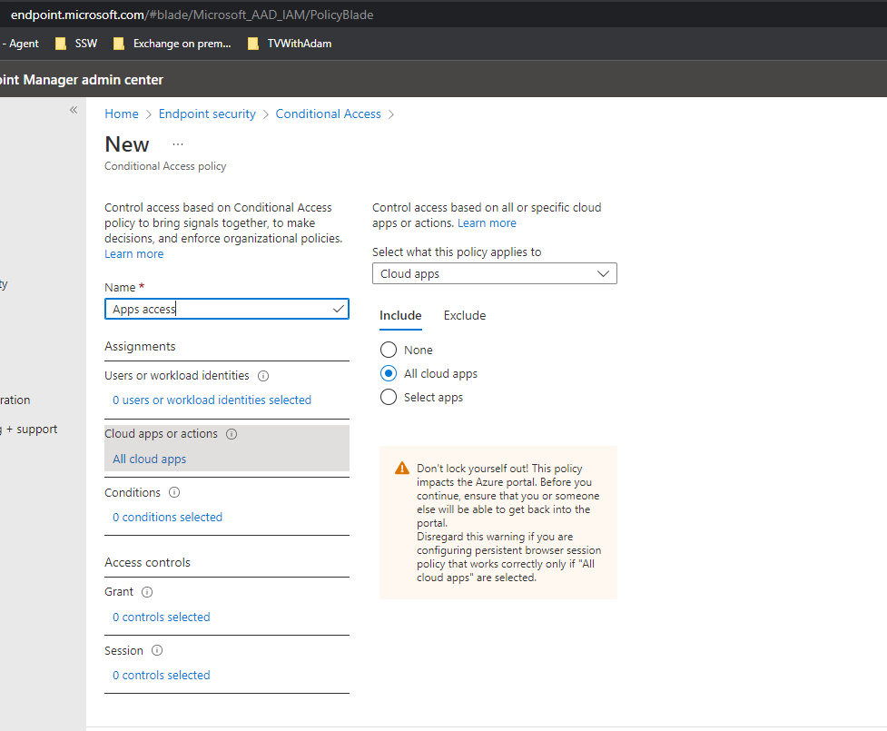
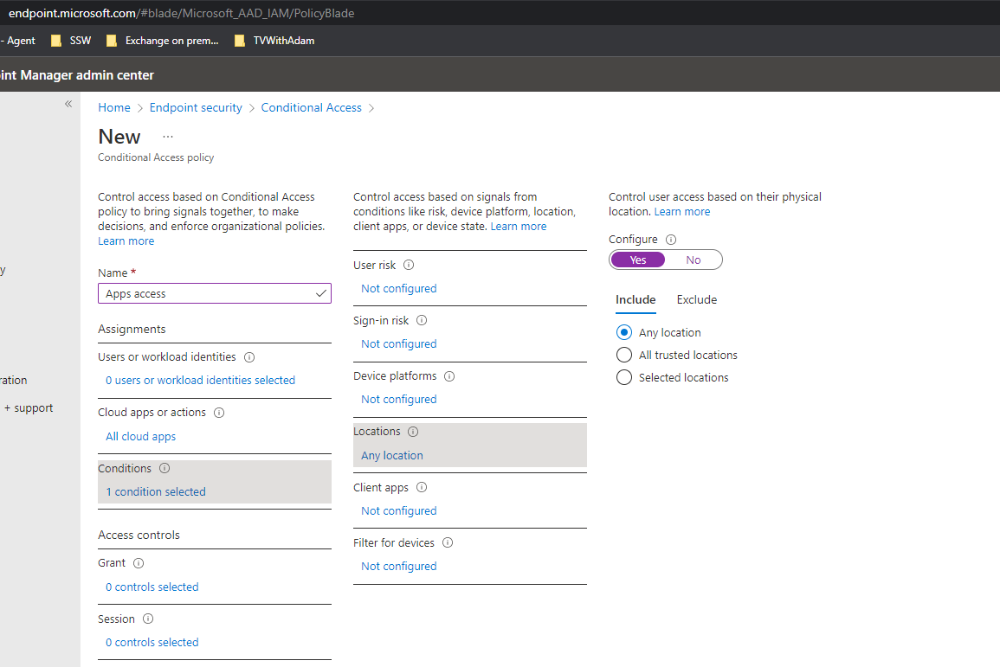
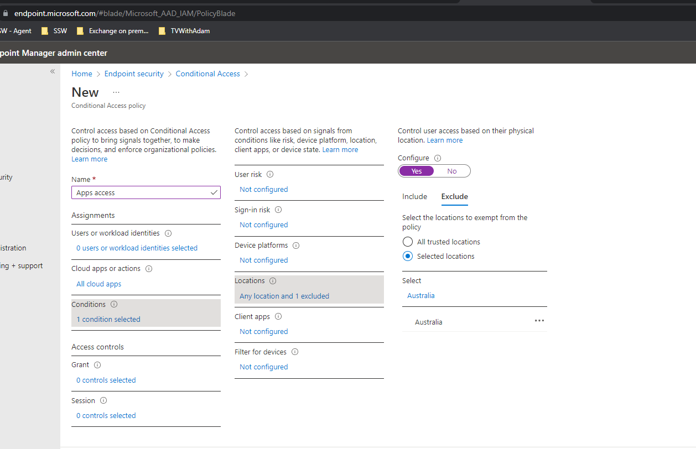
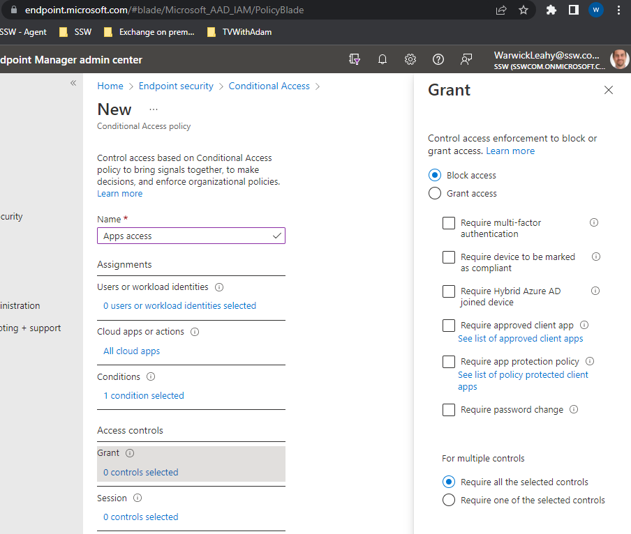
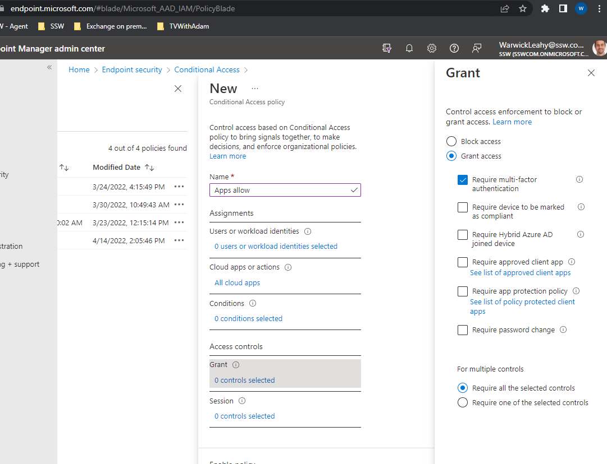

Did you know that you can stop your users from logging into any of your Azure or Office365 resources based on the location they are in?  What about the types of devices that they can connect from or only allowing connections that use MFA? These things are all possible to restrict.

This seriously limits the attack surface and also helps to stop compromised devices and accounts from being used.

<!--endintro-->

::: bad 

:::

## Configure locations

First you need to add any locations that you require for an office. 

1. Go to https://endpoint.microsoft.com | Endpoint security | Conditional Access | Named locations
2. Click "+ Countries location and add required countries

   
3. Add as many as you require for your users to access

   

## Configure policies

Now configure some policies to implement these rules

1. Go to Go to https://endpoint.microsoft.com | Endpoint security | Conditional Access | Policies
2. Select New policy | Create new policy

   
3. Give it a name then select Cloud apps or actions | Select All cloud apps

   
4. Select Conditions | Locations 
   Then set configure to yes and Include to "Any location"

   
5. On Exclude choose Selected locations and then exclude your workers countries (i.e. Australia) 

 **Note this must be done this way as the user must not meet a block access rule ever if they are to login**

6. Now select block access for this rule

   

   ## Create a grant rule
7. Similarly create a rule that applies to all cloud apps as above
8. This will be exactly the same as the above rule except that you should not have conditions and should Grant access with MFA

   