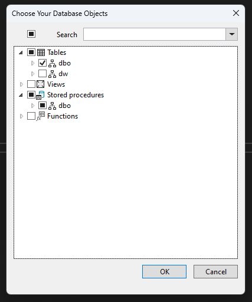

Some older projects .NET Framework project will have EDMX instead of modern DbContext first introduced in [Entity Framework 4.1](https://devblogs.microsoft.com/cesardelatorre/entity-framework-4-1-just-released/), which first introduced DbContext and Code-First approach back in 2012, replacing the ObjectContext that EDMX used for Database-First approach.

In this rule, we’ll use ObjectContext and Entities interchangeably. ObjectContext is the base class that is used by the generated class, which will generally end with Entities (e.g. DataEntities).

The rule is focusing on .NET 8+ as the support for .NET Framework projects and Nuget was added back, which makes a staged migration a lot more feasible. Most, if not all, are still applicable for .NET 7 as well.

## Strategies

There are a few strategies regarding the migration from a full rewrite with to a more in-place migration. Depending on the scale and complexity of the project. This rule will describe an approach that balances the code we need to rewrite and modernisation.

The focus is to minimise the amount of time no deployments are made due to migration.

The strategy in this rules will include:

1. Abstract existing `ObjectContext/Entities` class with a custom `IDbContext` interface (e.g. `ITenantDbContext`)
2. Scaffold DB
    1. [EF Core Power Tools](https://marketplace.visualstudio.com/items?itemName=ErikEJ.EFCorePowerTools)
        1. If the tool fails, use When to use EF Core 3.1 or EF Core 8+ CLI for scaffolding. EF Core 3.1 can better deal with older DB schemes than EF Core 8+
3. Implement interface from step 1 and refactor entities
    1. Review entities, adjust generated code and update `DbContext.OnConfiguring`
    2. Replace `ObjectSet<T>` with `DbSet<T>`
    3. Make any other necessary refactors
        1. Nullables might be treated differently
        2. Some properties will be a different type and you'll need to fix the mapping
        3. Lazy loading can be an issue. Fix it with eager loading.
        4. When upgrading to EF Core 3.1, group by and some other features are not supported
            1. Use `.AsEnumerable()`, use raw SQL or change how the query works
            2. Add a **TechDebt** comment and PBI - [Do you know the importance of paying back Technical Debt?](/technical-debt/)
4. Update namespaces (for Entities, EF Core namespaces and removing legacy namespaces)
    1. Remove `System.Data.Entity` namespace in all files using EF Core 3.1 (otherwise, you'll get odd Linq exceptions)
    2. Add `Microsoft.EntityFrameworkCore` namespace
5. Update dependency injection
    1. Use modern `.AddDbContext()` or `.AddDbContextPool()`
6. Update migration strategy (from DB-first to Code-first)
    1. Use EF Core CLI instead of DbUp
7. Remove EDMX completely (can be done sooner if migration is done in 1 go rather than in steps)
8. Optional: Upgrade to .NET 8+ (if on .NET Framework or .NET Core 3.1)
9. Optional: Upgrade to EF Core 8+ (if EF Core 3.1 path was necessary)
10. Test, test, test...
    1. Going from EDMX to EF Core 3.1 or later is a significant modernization with many under-the-hood changes
    2. Common issues are:
        1. Lazy loading
        2. Group by (if in EF Core 3.1)
        3. Unsupported queries (code that was secretly running on .NET side instead of SQL Server)
        4. Performance issues because of highly complicated queries
        5. Incorrect results from EF Core query

Steps 6 and 7 are required when upgrading from .NET Framework to .NET 8 and the solution is too complex to do the migration in one go. For simple projects, if EDMX is the only major blocking issue, they should go straight to .NET 8 and EF Core 8.

::: greybox
NOTE: With some smart abstraction strategies, it is possible to do steps 3 - 5 while still having a working application. It is only recommended for experienced developers in architecture and how EF operates to avoid bugs related to running 2 EF tracking systems. This will impact EF internal caching and saving changes.
:::

In this rule, we'll only cover abstracting access to `ObjectContext` with a custom `IDbContext` and how to scaffold the DB. The rest of the steps require in-depth code review and may differ greatly between projects.

## 1. Abstracting access to ObjectContext/Entities

Before starting, it’s important to note that ObjectContext and EDMX are no longer supported and we need to do a full rewrite of the data layer. You can wrap ObjectContext with an interface that looks like modern DbContext, as most commonly used methods are identical.

The wrapper below not only allows us to use ObjectContext in a cleaner way (see [Rules to Better Clean Architecture](/rules-to-better-clean-architecture/)) but also allows us to better manage the differences between ObjectContext and DbContext without needing to refactor the business logic.

::: greybox

```csharp
using System.Data.Entity.Core.Objects;

public interface ITenantDbContext
{
    ObjectSet<Client> Clients { get; }

    int SaveChanges();
    Task<int> SaveChangesAsync(CancellationToken ct = default);
}

/// <summary>
/// Implement DbContext as internal, so that external libraries cannot access it directly.
/// Expose functionality via interfaces instead.
/// </summary>
internal class TenantDbContext : ITenantDbContext
{
    private readonly DataEntities _entities;

    public TenantDbContext(DataEntities entities)
    {
        _entities = entities;
    }

    public ObjectSet<Client> Clients => _entities.Clients;

    public int SaveChanges() => _entities.SaveChanges();
    public Task<int> SaveChangesAsync(CancellationToken ct = default) => _entities.SaveChangesAsync(ct);
}
```

:::

::: good
Figure: Abstracting ObjectEntities behind an interface and using an interface to reduce the amount of issues while migrating.
:::

::: greybox
NOTE: The changes made in this section are still compatible with .NET Framework, allowing us to deliver value to the clients while the above changes are made.
:::

## 2. Scaffolding the DB

Now that we abstracted access to the data, it's time to scaffold the DB. The easiest way to do this is by using [EF Core Power Tools](https://marketplace.visualstudio.com/items?itemName=ErikEJ.EFCorePowerTools).

1. Right click on the project | **EF Core power Tools** | **Reverse Engineer**

   

2. Choose your data connection and EF Core version

   

3. Choose your database objects (tables, views, stored procedures, etc.)

   

4. Choose the settings for your project
   1. Recommended: **Use DataAnnotation attributes to configure the model** to reduce a lot of lines of code in DbContext
   2. Optional: **Install the EF Core provider package in the project** if you have not yet done that
   3. Optional: **Use table and column names directly from the database** if your existing code relies on that naming scheme

   

5. Code will generate under the path we decided (**EntityTypes path**). In this case, it's `Persistence` folder

  

6. A `DbContext` class will be auto-generated by EF Core Power Tools

  

# Resources

* How to migrate to EF Core 3.1 video - [https://learn.microsoft.com/en-us/shows/on-net/migrating-edmx-projects-to-entity-framework-core](https://learn.microsoft.com/en-us/shows/on-net/migrating-edmx-projects-to-entity-framework-core#time=08m10s)
* Official porting docs to EF Core 3.1 - <https://learn.microsoft.com/en-us/ef/efcore-and-ef6/porting/port-edmx>

# Alternative

EF Core 3.1 EDMX - [Walk-through: Using an Entity Framework 6 EDMX file with .NET Core | ErikEJ's blog](https://erikej.github.io/ef/dotnetcore/2020/06/15/ef6-use-edmx-dotnetcore.html)

While the above blog is supposedly working in EF Core 3.1, there is no information on whether that is true for .NET 8. It would still require a lot of migrations.

Limitations:

* EDMX is not supported in .NET Standard or .NET or any other SDK-style projects (required for .NET migrations)
* Requires a dedicated .NET Framework project that is not yet upgraded to an SDK-style project to generate and update EDMX, models and ObjectContext
* EF6 and EDMX are out of support
* Built for EF Core 3.1 which is out of support
* Unknown if it works on .NET 8 even with legacy .NET Framework support
* ObjectContext (the core of EDMX) was slowly phasing out, being replaced by DbContext in 2012
